CS5801 Coursework Template Proforma
================
2039499

``` r
suppressMessages(library(e1071)) 
suppressMessages(library(tidyverse))
suppressMessages(library(geoR))
suppressMessages(library(rcompanion))
suppressMessages(library(ggpubr))
suppressMessages(library(cowplot))
suppressMessages(library(rpart))
suppressMessages(library(rpart.plot))
suppressMessages(library(caret))
suppressMessages(library(validate))
```

# 1. Organise and clean the data

## 1.1 Subset the data into the specific dataset allocated

``` r
#load the rda file
load(file = "CS5801_data.rda")

# Create a subset of the data with two teams based on the last two digits of my student ID (99 which becomes 90)
my_teams <- subset(CS5801.data, teamID.x=="KCA" | teamID.x=="BOS")

# Make a copy of the original dataframe that we can check back when necesssary after making any changes
df_copy <- subset(CS5801.data, teamID.x=="KCA" | teamID.x=="BOS")
```

## 1.2 Data quality analysis

# Implementation

1.  

``` r
#Examine the data structure and make sure the data has been read in correctly
str(my_teams)
```

    ## 'data.frame':    79 obs. of  15 variables:
    ##  $ playerID     : chr  "barnema01" "bettsmo01" "bogaexa01" "bradlja02" ...
    ##  $ teamID.x     : Factor w/ 149 levels "ALT","ANA","ARI",..: 16 16 16 16 16 16 66 66 16 16 ...
    ##  $ G            : int  32 145 156 74 45 18 45 140 80 2 ...
    ##  $ R            : int  0 92 84 43 0 0 6 101 35 0 ...
    ##  $ H            : int  0 174 196 55 0 0 17 169 69 0 ...
    ##  $ AB           : int  0 597 613 221 0 6 86 551 273 4 ...
    ##  $ RBI          : int  0 77 81 43 0 0 5 72 29 0 ...
    ##  $ weight       : int  210 180 210 200 190 190 205 205 195 220 ...
    ##  $ height       : int  76 69 73 70 72 75 73 74 69 75 ...
    ##  $ salary       : num  508500 514500 543000 528000 2000000 ...
    ##  $ birthDate    : Date, format: "1990-06-17" "1992-10-07" ...
    ##  $ career.length: num  0.312 0.509 1.366 1.752 9.443 ...
    ##  $ bats         : Factor w/ 3 levels "B","L","R": 3 3 3 2 2 2 3 3 3 2 ...
    ##  $ age          : num  24.5 22.2 22.3 24.7 34.4 ...
    ##  $ hit.ind      : num  0 1 1 1 0 0 1 1 1 0 ...

``` r
#it is good practice to quickly eyeball the dataframe
head(my_teams)
```

    ##     playerID teamID.x   G  R   H  AB RBI weight height   salary  birthDate
    ## 45 barnema01      BOS  32  0   0   0   0    210     76   508500 1990-06-17
    ## 64 bettsmo01      BOS 145 92 174 597  77    180     69   514500 1992-10-07
    ## 72 bogaexa01      BOS 156 84 196 613  81    210     73   543000 1992-10-01
    ## 81 bradlja02      BOS  74 43  55 221  43    200     70   528000 1990-04-19
    ## 84 breslcr01      BOS  45  0   0   0   0    190     72  2000000 1980-08-08
    ## 93 buchhcl01      BOS  18  0   0   6   0    190     75 12000000 1984-08-14
    ##    career.length bats      age hit.ind
    ## 45     0.3121150    R 24.54209       0
    ## 64     0.5092402    R 22.23409       1
    ## 72     1.3661875    R 22.25051       1
    ## 81     1.7522245    L 24.70363       1
    ## 84     9.4428474    L 34.39836       0
    ## 93     7.3757700    L 30.38193       0

``` r
#converting hit.ind into a factor
my_teams$hit.ind <- as.factor(my_teams$hit.ind)

#removes the extra levels from teamID
my_teams$teamID.x = droplevels(my_teams$teamID.x)

#convert hit.ind 0 into a no and hit.ind 1 into a yes
recode <- c(no = 0, yes = 1)
my_teams$hit.ind <- factor(my_teams$hit.ind, levels = recode, labels = names(recode))

#check for missing values
colSums(is.na(my_teams))
```

    ##      playerID      teamID.x             G             R             H 
    ##             0             0             0             0             0 
    ##            AB           RBI        weight        height        salary 
    ##             0             0             0             0             0 
    ##     birthDate career.length          bats           age       hit.ind 
    ##             0             0             0             0             0

2.  

``` r
#after viewing the dataset salary has been read in under scientific notation - the following code removes it
options(scipen = 999)

#change column names to make data more intuitive
colnames(my_teams)[3] <- 'games'
colnames(my_teams)[4] <- 'runs'
colnames(my_teams)[5] <- 'hits'
```

3.  

``` r
#confirming there are 3 values for bats - both arms, left arm and right arm
table(my_teams$bats)
```

    ## 
    ##  B  L  R 
    ##  7 19 53

``` r
#to examine the data and help spot outliers
summary(my_teams)
```

    ##    playerID         teamID.x     games             runs             hits       
    ##  Length:79          BOS:42   Min.   :  1.00   Min.   :  0.00   Min.   :  0.00  
    ##  Class :character   KCA:37   1st Qu.: 22.50   1st Qu.:  0.00   1st Qu.:  0.00  
    ##  Mode  :character            Median : 43.00   Median :  1.00   Median :  2.00  
    ##                              Mean   : 58.67   Mean   : 19.92   Mean   : 41.16  
    ##                              3rd Qu.: 91.50   3rd Qu.: 38.00   3rd Qu.: 68.50  
    ##                              Max.   :158.00   Max.   :101.00   Max.   :196.00  
    ##        AB             RBI            weight          height     
    ##  Min.   :  0.0   Min.   : -4.0   Min.   :165.0   Min.   :38.00  
    ##  1st Qu.:  0.0   1st Qu.:  0.0   1st Qu.:195.0   1st Qu.:71.00  
    ##  Median :  6.0   Median :  1.0   Median :210.0   Median :73.00  
    ##  Mean   :154.1   Mean   : 18.8   Mean   :212.5   Mean   :72.46  
    ##  3rd Qu.:298.0   3rd Qu.: 31.5   3rd Qu.:225.0   3rd Qu.:75.00  
    ##  Max.   :613.0   Max.   :108.0   Max.   :268.0   Max.   :82.00  
    ##      salary           birthDate          career.length     bats  
    ##  Min.   :     515   Min.   :1975-04-03   Min.   : 0.2902   B: 7  
    ##  1st Qu.:  561750   1st Qu.:1983-06-26   1st Qu.: 2.5968   L:19  
    ##  Median : 2000000   Median :1985-09-23   Median : 4.7310   R:53  
    ##  Mean   : 4620822   Mean   :1985-10-20   Mean   : 5.7752         
    ##  3rd Qu.: 7500000   3rd Qu.:1988-12-24   3rd Qu.: 8.3614         
    ##  Max.   :19750000   Max.   :2002-06-17   Max.   :35.6372         
    ##       age        hit.ind 
    ##  Min.   :22.23   no :37  
    ##  1st Qu.:26.17   yes:42  
    ##  Median :29.32           
    ##  Mean   :29.57           
    ##  3rd Qu.:31.70           
    ##  Max.   :39.75

``` r
#checks for duplicated vales
duplicated(my_teams$playerID)
```

    ##  [1] FALSE FALSE FALSE FALSE FALSE FALSE FALSE FALSE FALSE FALSE FALSE FALSE
    ## [13] FALSE FALSE FALSE FALSE FALSE FALSE FALSE FALSE FALSE FALSE FALSE FALSE
    ## [25] FALSE FALSE FALSE FALSE FALSE FALSE FALSE FALSE FALSE FALSE FALSE FALSE
    ## [37] FALSE FALSE FALSE FALSE FALSE FALSE FALSE FALSE FALSE FALSE FALSE FALSE
    ## [49] FALSE FALSE FALSE FALSE FALSE FALSE FALSE FALSE FALSE FALSE FALSE FALSE
    ## [61] FALSE FALSE FALSE FALSE FALSE FALSE FALSE FALSE FALSE  TRUE FALSE FALSE
    ## [73] FALSE FALSE  TRUE FALSE FALSE FALSE FALSE

``` r
#finds the name of the player that is duplicated
my_teams$playerID[duplicated(my_teams$playerID)]
```

    ## [1] "pedrodu01" "moralke01"

``` r
#create a new dataframe with the duplicate rows removed
my_teams_1 <- my_teams[!duplicated(my_teams$playerID), ]
```

4.  

``` r
#I have created a new dataframe by using the transform function to replace negative values with NA. 
my_teams_2 <- transform(my_teams_1, RBI = ifelse(RBI < 0, NA, RBI))

View(my_teams_2)
#check constraints
val.check <- check_that(my_teams_2, 
                         age > 16 & age < 50,
                         height > 60,
                         AB >= hits,
                         career.length < age)

#we plot the data test to see if our checks failed or passed
barplot(val.check)
```

    ## Warning: The 'barplot' method for confrontation objects is deprecated. Use
    ## 'plot' instead

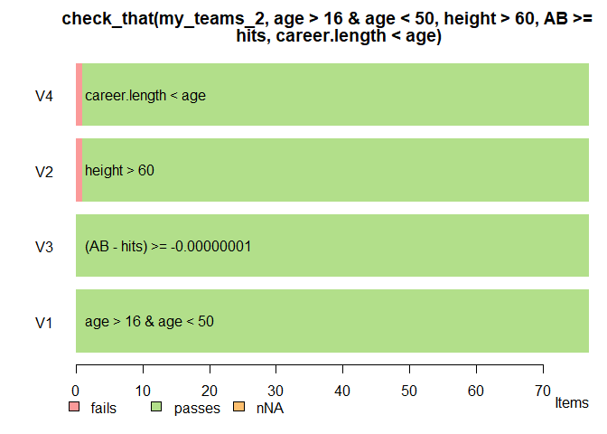<!-- -->

5.  

``` r
#any player under 60 inches will be converted into a NA value - I create a new dataset with the imputed value
my_teams_3 <- transform(my_teams_2, height = ifelse(height < 60, NA, height))

#replace values where career length is greater than age with NA
my_teams_4 <- transform(my_teams_3, career.length = ifelse(career.length < age, career.length, NA))
```

6.  

``` r
#helps us find which row this value is in
which(my_teams_4$birthDate == '2002-06-17')
```

    ## [1] 70

``` r
#converts our value into NA
my_teams_4$birthDate[70] <- NA
```

7.  

``` r
#examine salary
summary(my_teams_4$salary)
```

    ##     Min.  1st Qu.   Median     Mean  3rd Qu.     Max. 
    ##      515   557000  2000000  4494090  7500000 19750000

``` r
#any salary under 300,000 will be converted into a NA value (reference_7)
my_teams_5 <- transform(my_teams_4, salary = ifelse(salary < 300000, NA, salary))
```

8.  

``` r
#remove birthdate as it is redundant in our model as we have age
my_teams_6 <- subset(my_teams_5, select = -birthDate )

#create a new variable hitRate
my_teams_6$hitRate <- my_teams_6$hits/my_teams_6$AB

#convert NaNs to 0
my_teams_6$hitRate[is.nan(my_teams_6$hitRate)]<-0

#remove hit.ind
my_teams_7 <- subset(my_teams_6, select = -hit.ind)

#at this point I can omit the rows with missing values
my_teams_clean <- na.omit(my_teams_7)
```

## 1.3 Data cleaning

1.  From comparing the structure to our metadata adendum I have
    identified two immediate problems with how our data has been read in
    by R - hit.ind should be a factor with two levels and teamID.x
    should be a factor with two levels. It is important for our analysis
    to correct these as we may want to understand the effects of each
    level on a variable. I removed them using the droplevels() function
    so they do not harm our analysis. (reference_12)

I used the str() function to look at the structure of the data and
ensure text variables are stored as text and numeric variables as
number. (reference_13). R has read in the rest of the data correctly
assigning numeric, char, Factor and Data appropriately.

Recoded the factors of hit.ind from 0(no hit) & 1(hit) into ‘no’ and
‘yes’ to make the variable more readable and intuitive (reference_13).

2.  After viewing the data I noticed salary was in scientific notation
    which I removed to make it easier for us to understand the numbers
    we are working with. I decided to make our dataset more intuitive
    and readable by changing a few of the column names.

3.  From the summary function I have spotted possible issues with:

    1.  RBI - having negative values (must be positive - set out in
        metadta)
    2.  height - having a min value of 38 inches - possible outlier.
    3.  salary - having a min value of 515 - possible outlier.
    4.  birthDate - having a max value of 2002-06-17 - possible outlier.
    5.  career.length - having a max value of 35.6372 - possible
        outlier.

I also checked for missing values and duplicated values. I use the
duplicated() function with player.id and found two players - “pedrodu01”
“moralke01” - that were duplicated. I removed the duplicates from our
data. (reference_14).

When I make any changes to the dataframe, I will create another
dataframe and not keep editing the original to make our code and data
re-traceable and easier to correct if any mistakes are made.

4.  After checking the metadata I have performed the following checks
    for referential constraints using the validate package
    (reference_12):
    1.  age is older than 16 and younger than 50.
    2.  Height is greater than 60 inches (average height is 72)
    3.  AB must be greater or equal to hits - as the player cannot hit
        without having the opportunity to hit.
    4.  career length must be less than age.
5.  Height has an outlier of 38 inches - It it safe to assume this is an
    error as 38 inches is 3 foot tall which is shorter than the shortest
    player in baseball history (note_2 & reference_1)

At this stage I have decided to convert these outliers to NA - NA is a
special character in R which will represent a missing value. The
benefits of using this character is the ability to use functions such as
is.na to detect NA’s. At a later stage I will decide what to do with
these NA’s - deletion or imputation.(reference_13)

‘Outliers do not mean errors’ (reference_13) - they could be interesting
edge cases and dont necessarily need to be removed, however, in our
cases each outlier has been proven to be an error/implausible which is
why I have convereted them to NA’s.

6.  Another obvious inconsistency is taking a players birthday and
    adding their age to make sure it does not pass 2020. Our dataset is
    small enough for me to eyeball and see that only one player fails
    this constraint which is our outlier on Birthdate. As the age falls
    well within our datasets range but the Birthdate falls well outside
    I have assumed that the error lies in birthDate and will now convert
    it into NA.

7.  As I am not familiar with baseball players salaries in the US, our
    dataset having such a large range made me feel the need to consult
    outside references to ensure the salary figures are plausible.

-   By checking I was able to determine the mean salary is suitable
    (reference_2)
-   I was able to determine that our maximum salary is suitable as it
    falls well below the max salary of any players (reference_3)
-   I was also able to determine that our outlier must be incorrect data
    as the minimum MLB salary from 2003-2020 was $300,000 (reference_4).
    Seeing as this player has played over a year we can safely assume
    this is an error in our dataset.

8.  I removed birthDate as it is superfluous given we have Age. I also
    explored creating a new variable hitRate dividing the number of hits
    by the opportunities to hit. I wanted to explore if this would be a
    good predictor for salary. The result was many NaN values as we are
    diving in many cases by 0 so I converted these to 0.

I removed hit.ind as whether a player makes a hit in the 2015 season or
not would not impact their salary for the 2015 season, if hit.ind was
from the previous year then it would make sense to include in our model.
I believe it is safe to assume salaries of the 2015 season are decided
before the 2015 season starts.

I will treat our missing values with case wise deletion as it should not
be problematic as we only have a few cases of missing variables -
specifically 7. I decided against imputation methods(mean,regression
etc) as I do not know for certain the values are missing at random,
moreover, when building regression models I do not want to affect the
dispersion or variance of our data.

# 2. Exploratory Data Analysis (EDA)

## EDA and summary of results

I checked the data visually using ggplot to build different graphs.

All of the histograms below show a rough bell curve implying normality
in our variables: games, weight, height, career.length and age.

``` r
#to remind me what data types I am working with
str(my_teams_clean)
```

    ## 'data.frame':    72 obs. of  14 variables:
    ##  $ playerID     : chr  "barnema01" "bettsmo01" "bogaexa01" "bradlja02" ...
    ##  $ teamID.x     : Factor w/ 2 levels "BOS","KCA": 1 1 1 1 1 1 2 2 1 1 ...
    ##  $ games        : int  32 145 156 74 45 18 45 140 80 2 ...
    ##  $ runs         : int  0 92 84 43 0 0 6 101 35 0 ...
    ##  $ hits         : int  0 174 196 55 0 0 17 169 69 0 ...
    ##  $ AB           : int  0 597 613 221 0 6 86 551 273 4 ...
    ##  $ RBI          : int  0 77 81 43 0 0 5 72 29 0 ...
    ##  $ weight       : int  210 180 210 200 190 190 205 205 195 220 ...
    ##  $ height       : int  76 69 73 70 72 75 73 74 69 75 ...
    ##  $ salary       : num  508500 514500 543000 528000 2000000 ...
    ##  $ career.length: num  0.312 0.509 1.366 1.752 9.443 ...
    ##  $ bats         : Factor w/ 3 levels "B","L","R": 3 3 3 2 2 2 3 3 3 2 ...
    ##  $ age          : num  24.5 22.2 22.3 24.7 34.4 ...
    ##  $ hitRate      : num  0 0.291 0.32 0.249 0 ...
    ##  - attr(*, "na.action")= 'omit' Named int [1:5] 71 73 74 75 76
    ##   ..- attr(*, "names")= chr [1:5] "921" "923" "935" "936" ...

``` r
#histogram for games played
ggplot(my_teams_clean, aes(x = games)) + geom_histogram(binwidth = 5, fill = 'steelblue') + ggtitle('Number Of Games Played') + xlab('Games') + ylab('Count') + theme_classic()
```

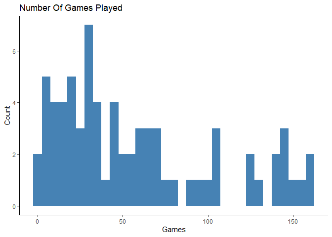<!-- -->

``` r
#histogram for career length of players
ggplot(my_teams_clean, aes(x = career.length)) + geom_histogram(binwidth = 0.5, fill = 'steelblue') + ggtitle('Career Length of Players') + xlab('Lenght In Years') + ylab('Count') + theme_classic()
```

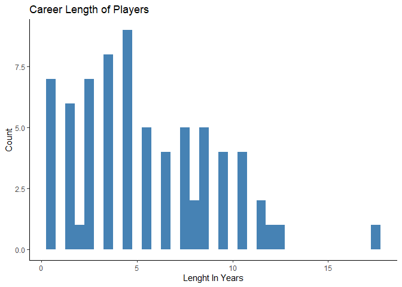<!-- -->

``` r
#histogram for age of players
ggplot(my_teams_clean, aes(x = age)) + geom_histogram(fill = 'steelblue') + ggtitle('Age of Players') + xlab('Age In Years') + ylab('Count') + theme_classic()
```

    ## `stat_bin()` using `bins = 30`. Pick better value with `binwidth`.

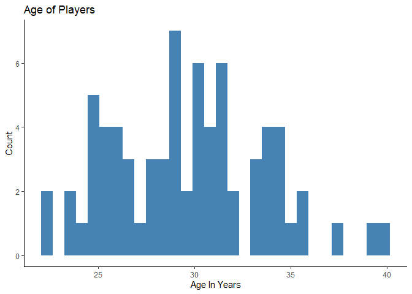<!-- -->

``` r
#histogram for the salary of players
ggplot(my_teams_clean, aes(x = salary)) + geom_histogram(fill = 'steelblue') + ggtitle('Salary of Players') + xlab('Salary In Dollars') + ylab('Count') + theme_classic()
```

    ## `stat_bin()` using `bins = 30`. Pick better value with `binwidth`.

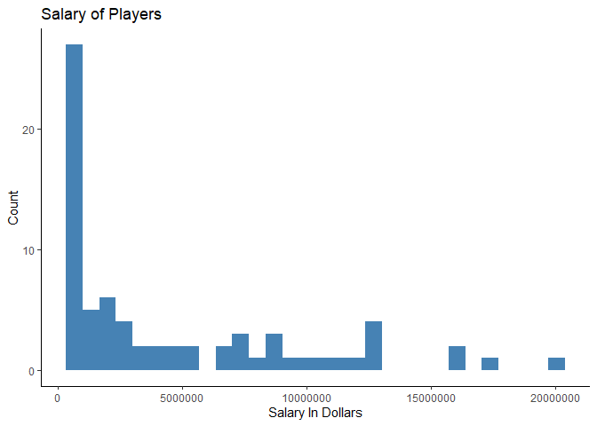<!-- -->

``` r
#scatterplot of salary vs career length by team
ggplot(my_teams_clean, aes(x = salary, y = career.length )) + geom_point(aes(color = teamID.x)) + ggtitle('Salary Vs Career Length by Team') + xlab('Salary') + ylab('Career Length in Years') + theme_classic()
```

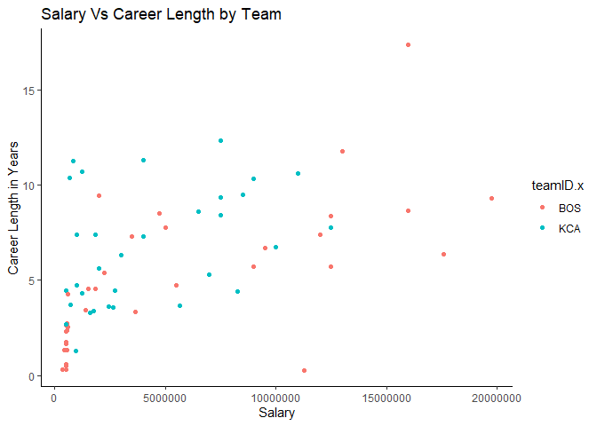<!-- -->

``` r
#scatterplot of salary vs games played by team
ggplot(my_teams_clean, aes(x = salary, y = games )) + geom_point(aes(color = teamID.x)) + ggtitle('Salary Vs Games Played by Team') + xlab('Salary') + ylab('Games Played') + theme_classic()
```

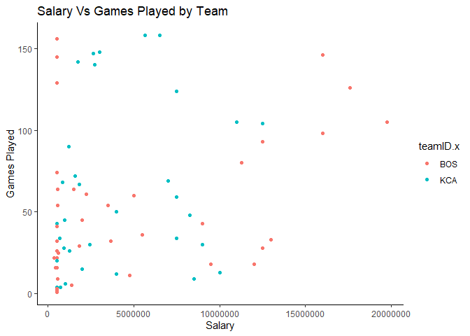<!-- -->

``` r
#scatterplot of salary vs hits length by team
ggplot(my_teams_clean, aes(x = salary, y = hits )) + geom_point(aes(color = teamID.x)) + ggtitle('Salary Vs Hits by Team') + xlab('Salary') + ylab('Hits') + theme_classic()
```

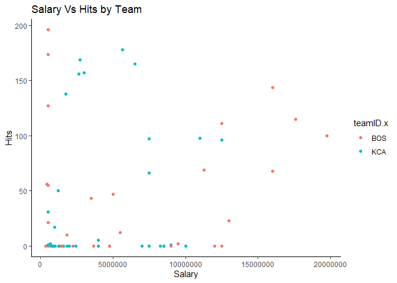<!-- -->

With the help of boxplots, we are able to understand the location,
dispersion and skewness of the dataset.

``` r
#boxplot of salary vs team
ggplot(my_teams_clean, aes(x = teamID.x, y = salary)) + geom_boxplot(aes(fill = teamID.x))  + ggtitle('Salary by Team') + xlab('BOS VS KCA') + ylab('Salary') + theme_classic()
```

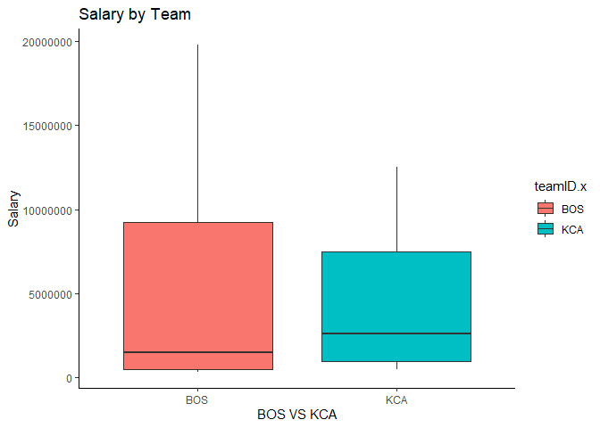<!-- -->

``` r
#boxplot of games played per team
ggplot(my_teams_clean, aes(x = teamID.x, y = games)) + geom_boxplot(aes(fill = teamID.x))  + ggtitle('Games played per Team') + xlab('BOS vs KCA') + ylab('Games') + theme_classic()
```

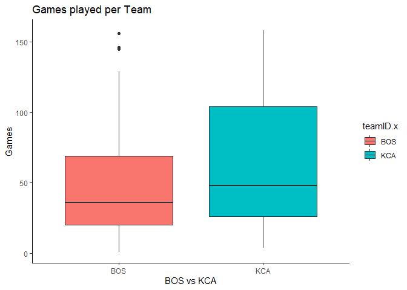<!-- -->

``` r
#boxplot of career length per team
ggplot(my_teams_clean, aes(x = teamID.x, y = career.length)) + geom_boxplot(aes(fill = teamID.x))  + ggtitle('Career Length per Team') + xlab('BOS vs KCA') + ylab('Years') + theme_classic()
```

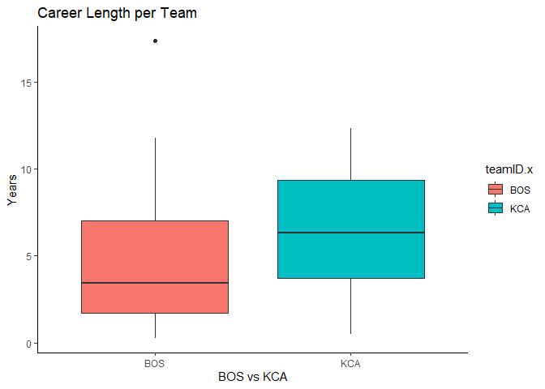<!-- -->

## Additional insights and issues

I will now create a numeric subset of our data allowing us to use the
pairs function which helps us multi-collinearity in our data.

``` r
#create a subset with only the continuous explanatory variables
my_teams_cont <- subset(my_teams_7, select = c('games', 'runs', 'hits', 'AB', 'RBI', 'weight', 'height', 'salary', 'career.length', 'age', 'hitRate'))

#when we have multiple continuous variables we can use the pairs function to graph all the data looking for correlations
pairs(my_teams_cont, panel = panel.smooth)
```

<!-- -->

Multi-collinearity occurs when two explanatory variables are highly
correlated - we can detect this using our pairswise plot. If both are
used in our model it makes it difficult to interpret the role of each
one so we choose one and remove the other. We can see that there is a
positive correlation between each pairing of games, runs, hits, AB and
RB which is to be expected as the more games you play allows you chances
for more runs and hits. I will remove one variable at a time and see how
it effects our model.

We can see again the positive correlation between salary and
career.length.

# 3. Modelling

## 3.1 Build a model for player salary

# Plan

When deciding on which model to use, our first step is to recognize what
type of data Our dependent variable and explanatory variables are. In
this dataset our dependent variable is salary which is numeric
continuous. Our explanatory variables are a mixture of numeric and
categorical. Therefore we will model our data using ANCOVA.

When performing model analysis we make assumptions on our data -
randomly sampled - homooscedasticity (homogneity of variance) - normal
errors - independent errors

So we will fit our initial model and then remove our highly correlated
explanatory variables one by one. Once that is complete I will use the
step function to find the minimal adequate model based on the lowest AIC
score. I will examine our final model using residual plots. If the
residual plots look okay then we are fine however if they do not we will
need to look into transforming our data. We know already from our EDA
that some of are data is heavily skewed/not normal. This may present
issues and lead to the need for transformations.

# Implementation

``` r
#firsly build a maximal model including all the possible explanatory variables
model <- lm(salary~games+runs+hits+AB+RBI+weight+height+career.length+bats+age+hitRate+teamID.x, data = my_teams_clean)
summary(model)
```

    ## 
    ## Call:
    ## lm(formula = salary ~ games + runs + hits + AB + RBI + weight + 
    ##     height + career.length + bats + age + hitRate + teamID.x, 
    ##     data = my_teams_clean)
    ## 
    ## Residuals:
    ##      Min       1Q   Median       3Q      Max 
    ## -5823312 -2180215  -692513  2178509  8422577 
    ## 
    ## Coefficients:
    ##               Estimate Std. Error t value  Pr(>|t|)    
    ## (Intercept)    7365441   14800954   0.498    0.6206    
    ## games             3120      27350   0.114    0.9096    
    ## runs             19274      95881   0.201    0.8414    
    ## hits           -131523      91875  -1.432    0.1576    
    ## AB               37502      21022   1.784    0.0797 .  
    ## RBI               7401      67618   0.109    0.9132    
    ## weight           22373      27780   0.805    0.4239    
    ## height          -98581     221097  -0.446    0.6573    
    ## career.length   949762     224474   4.231 0.0000838 ***
    ## batsL          -620226    1988859  -0.312    0.7563    
    ## batsR           366654    1792346   0.205    0.8386    
    ## age            -187222     193839  -0.966    0.3381    
    ## hitRate         489157    4284270   0.114    0.9095    
    ## teamID.xKCA   -2604914    1010743  -2.577    0.0125 *  
    ## ---
    ## Signif. codes:  0 '***' 0.001 '**' 0.01 '*' 0.05 '.' 0.1 ' ' 1
    ## 
    ## Residual standard error: 3904000 on 58 degrees of freedom
    ## Multiple R-squared:  0.4972, Adjusted R-squared:  0.3845 
    ## F-statistic: 4.411 on 13 and 58 DF,  p-value: 0.00003908

``` r
#diagnostic plots
plot(model)
```

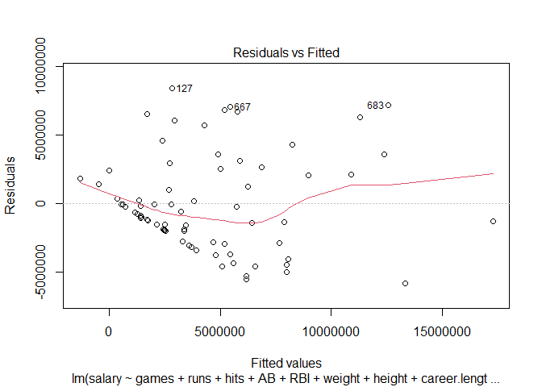<!-- -->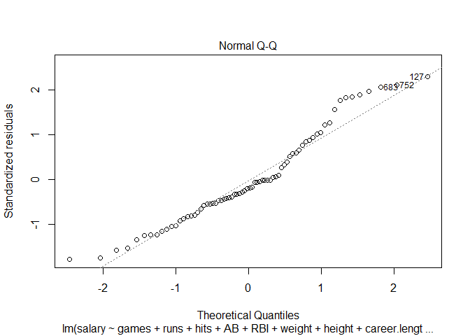<!-- -->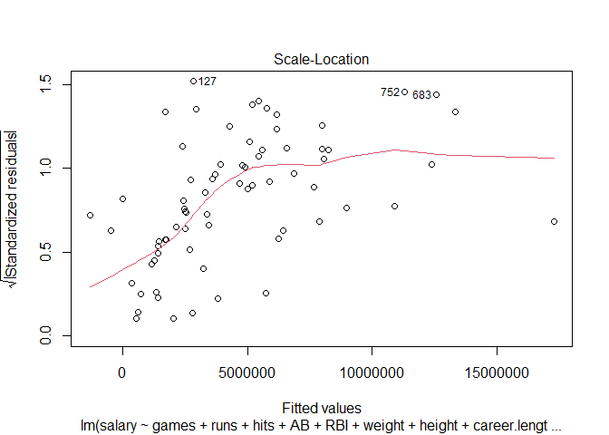<!-- -->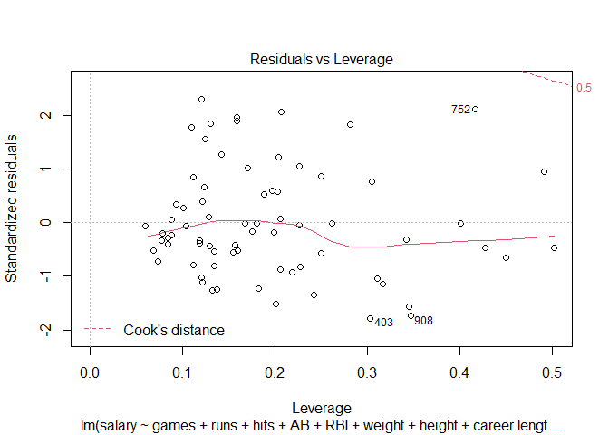<!-- -->

``` r
#removed AB
model_2 <- lm(salary~games+runs+hits+RBI+weight+height+career.length+bats+age+hitRate+teamID.x, data = my_teams_clean)
summary(model_2)
```

    ## 
    ## Call:
    ## lm(formula = salary ~ games + runs + hits + RBI + weight + height + 
    ##     career.length + bats + age + hitRate + teamID.x, data = my_teams_clean)
    ## 
    ## Residuals:
    ##      Min       1Q   Median       3Q      Max 
    ## -6107496 -2507676  -653899  1944249  9114388 
    ## 
    ## Coefficients:
    ##               Estimate Std. Error t value  Pr(>|t|)    
    ## (Intercept)   11878660   14850412   0.800   0.42698    
    ## games            16010      26861   0.596   0.55344    
    ## runs              4578      97277   0.047   0.96263    
    ## hits              1445      54701   0.026   0.97901    
    ## RBI              -1642      68664  -0.024   0.98100    
    ## weight           32547      27686   1.176   0.24449    
    ## height         -196599     218087  -0.901   0.37100    
    ## career.length  1006990     226242   4.451 0.0000386 ***
    ## batsL         -1019758    2012429  -0.507   0.61423    
    ## batsR           219830    1823270   0.121   0.90444    
    ## age            -174479     197257  -0.885   0.38000    
    ## hitRate        1133699    4347250   0.261   0.79517    
    ## teamID.xKCA   -2818015    1022055  -2.757   0.00775 ** 
    ## ---
    ## Signif. codes:  0 '***' 0.001 '**' 0.01 '*' 0.05 '.' 0.1 ' ' 1
    ## 
    ## Residual standard error: 3976000 on 59 degrees of freedom
    ## Multiple R-squared:  0.4696, Adjusted R-squared:  0.3617 
    ## F-statistic: 4.353 on 12 and 59 DF,  p-value: 0.00006276

``` r
#removed RBI
model_3 <- lm(salary~games+runs+hits+weight+height+career.length+bats+age+hitRate+teamID.x, data = my_teams_clean)
summary(model_3)
```

    ## 
    ## Call:
    ## lm(formula = salary ~ games + runs + hits + weight + height + 
    ##     career.length + bats + age + hitRate + teamID.x, data = my_teams_clean)
    ## 
    ## Residuals:
    ##      Min       1Q   Median       3Q      Max 
    ## -6107779 -2512505  -662184  1939493  9111670 
    ## 
    ## Coefficients:
    ##               Estimate Std. Error t value Pr(>|t|)    
    ## (Intercept)   11933088   14552180   0.820  0.41545    
    ## games            15969      26582   0.601  0.55028    
    ## runs              3864      91807   0.042  0.96657    
    ## hits              1024      51363   0.020  0.98415    
    ## weight           32342      26104   1.239  0.22018    
    ## height         -196636     216257  -0.909  0.36685    
    ## career.length  1006260     222297   4.527 0.000029 ***
    ## batsL         -1023005    1991050  -0.514  0.60928    
    ## batsR           223617    1801185   0.124  0.90161    
    ## age            -174713     195366  -0.894  0.37474    
    ## hitRate        1147107    4274877   0.268  0.78936    
    ## teamID.xKCA   -2814087    1000334  -2.813  0.00662 ** 
    ## ---
    ## Signif. codes:  0 '***' 0.001 '**' 0.01 '*' 0.05 '.' 0.1 ' ' 1
    ## 
    ## Residual standard error: 3942000 on 60 degrees of freedom
    ## Multiple R-squared:  0.4696, Adjusted R-squared:  0.3723 
    ## F-statistic: 4.829 on 11 and 60 DF,  p-value: 0.00002715

``` r
#removed games
model_4 <- lm(salary~runs+hits+weight+height+career.length+bats+age+hitRate+teamID.x, data = my_teams_clean)
summary(model_4)
```

    ## 
    ## Call:
    ## lm(formula = salary ~ runs + hits + weight + height + career.length + 
    ##     bats + age + hitRate + teamID.x, data = my_teams_clean)
    ## 
    ## Residuals:
    ##      Min       1Q   Median       3Q      Max 
    ## -5981231 -2341429  -786164  1858110  9328974 
    ## 
    ## Coefficients:
    ##                 Estimate Std. Error t value  Pr(>|t|)    
    ## (Intercept)   12251759.4 14466125.3   0.847    0.4003    
    ## runs               567.5    91161.9   0.006    0.9951    
    ## hits             14574.7    45903.3   0.318    0.7519    
    ## weight           31050.0    25878.6   1.200    0.2348    
    ## height         -189322.9   214780.0  -0.881    0.3815    
    ## career.length  1028526.3   218033.7   4.717 0.0000144 ***
    ## batsL          -870736.3  1964477.5  -0.443    0.6592    
    ## batsR           218171.2  1791701.5   0.122    0.9035    
    ## age            -183800.5   193755.9  -0.949    0.3466    
    ## hitRate         822634.6  4218345.1   0.195    0.8460    
    ## teamID.xKCA   -2753023.2   989929.0  -2.781    0.0072 ** 
    ## ---
    ## Signif. codes:  0 '***' 0.001 '**' 0.01 '*' 0.05 '.' 0.1 ' ' 1
    ## 
    ## Residual standard error: 3922000 on 61 degrees of freedom
    ## Multiple R-squared:  0.4664, Adjusted R-squared:  0.3789 
    ## F-statistic: 5.331 on 10 and 61 DF,  p-value: 0.00001299

``` r
#removed hits
model_5 <- lm(salary~games+runs+weight+height+career.length+bats+age+hitRate+teamID.x, data = my_teams_clean)
summary(model_5)
```

    ## 
    ## Call:
    ## lm(formula = salary ~ games + runs + weight + height + career.length + 
    ##     bats + age + hitRate + teamID.x, data = my_teams_clean)
    ## 
    ## Residuals:
    ##      Min       1Q   Median       3Q      Max 
    ## -6112452 -2516848  -657034  1937060  9106398 
    ## 
    ## Coefficients:
    ##               Estimate Std. Error t value  Pr(>|t|)    
    ## (Intercept)   11965452   14342451   0.834   0.40739    
    ## games            16202      23685   0.684   0.49654    
    ## runs              5505      40349   0.136   0.89192    
    ## weight           32405      25697   1.261   0.21209    
    ## height         -197184     212739  -0.927   0.35764    
    ## career.length  1006424     220316   4.568 0.0000245 ***
    ## batsL         -1028146    1958053  -0.525   0.60143    
    ## batsR           222962    1786069   0.125   0.90107    
    ## age            -175099     192807  -0.908   0.36737    
    ## hitRate        1163716    4158490   0.280   0.78055    
    ## teamID.xKCA   -2814463     991928  -2.837   0.00617 ** 
    ## ---
    ## Signif. codes:  0 '***' 0.001 '**' 0.01 '*' 0.05 '.' 0.1 ' ' 1
    ## 
    ## Residual standard error: 3910000 on 61 degrees of freedom
    ## Multiple R-squared:  0.4696, Adjusted R-squared:  0.3826 
    ## F-statistic:   5.4 on 10 and 61 DF,  p-value: 0.0000111

``` r
#removed runs
model_6 <- lm(salary~games+weight+height+career.length+bats+age+hitRate+teamID.x, data = my_teams_clean)
summary(model_6)
```

    ## 
    ## Call:
    ## lm(formula = salary ~ games + weight + height + career.length + 
    ##     bats + age + hitRate + teamID.x, data = my_teams_clean)
    ## 
    ## Residuals:
    ##      Min       1Q   Median       3Q      Max 
    ## -6197355 -2550918  -659582  1947164  9078429 
    ## 
    ## Coefficients:
    ##               Estimate Std. Error t value  Pr(>|t|)    
    ## (Intercept)   12076062   14205739   0.850   0.39855    
    ## games            18912      12797   1.478   0.14451    
    ## weight           32459      25490   1.273   0.20763    
    ## height         -199375     210446  -0.947   0.34712    
    ## career.length  1003618     217611   4.612 0.0000205 ***
    ## batsL         -1039927    1940605  -0.536   0.59396    
    ## batsR           220638    1771796   0.125   0.90130    
    ## age            -175753     191216  -0.919   0.36159    
    ## hitRate        1381270    3810141   0.363   0.71819    
    ## teamID.xKCA   -2820526     983058  -2.869   0.00562 ** 
    ## ---
    ## Signif. codes:  0 '***' 0.001 '**' 0.01 '*' 0.05 '.' 0.1 ' ' 1
    ## 
    ## Residual standard error: 3879000 on 62 degrees of freedom
    ## Multiple R-squared:  0.4694, Adjusted R-squared:  0.3924 
    ## F-statistic: 6.094 on 9 and 62 DF,  p-value: 0.000004296

``` r
plot(model_6)
```

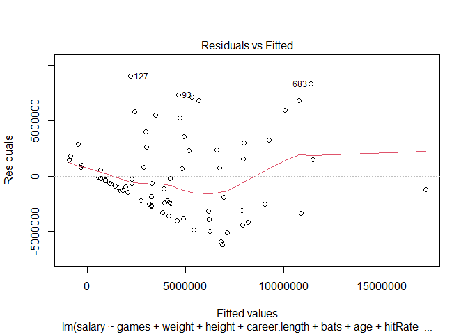<!-- --><!-- -->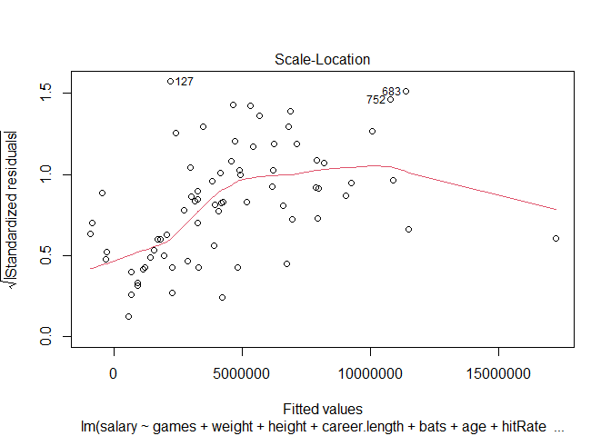<!-- -->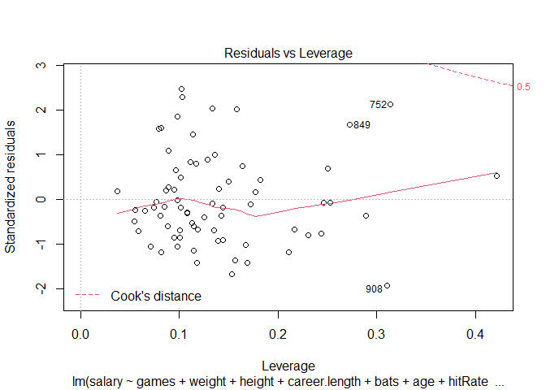<!-- -->

We then use the step function to help find our minimal adequate model

``` r
step(model_6)
```

    ## Start:  AIC=2193.87
    ## salary ~ games + weight + height + career.length + bats + age + 
    ##     hitRate + teamID.x
    ## 
    ##                 Df       Sum of Sq              RSS    AIC
    ## - bats           2  18891627656648  951766393661519 2191.3
    ## - hitRate        1   1977456074460  934852222079330 2192.0
    ## - age            1  12711234784599  945586000789470 2192.8
    ## - height         1  13504864891598  946379630896469 2192.9
    ## - weight         1  24398823024431  957273589029302 2193.7
    ## <none>                              932874766004871 2193.9
    ## - games          1  32861764298794  965736530303664 2194.4
    ## - teamID.x       1 123860765523410 1056735531528280 2200.8
    ## - career.length  1 320041581196091 1252916347200962 2213.1
    ## 
    ## Step:  AIC=2191.31
    ## salary ~ games + weight + height + career.length + age + hitRate + 
    ##     teamID.x
    ## 
    ##                 Df       Sum of Sq              RSS    AIC
    ## - hitRate        1   4289273581533  956055667243052 2189.6
    ## - age            1   9477051516814  961243445178333 2190.0
    ## - height         1  15796267615114  967562661276633 2190.5
    ## - games          1  24727026473941  976493420135461 2191.2
    ## <none>                              951766393661519 2191.3
    ## - weight         1  31720364862496  983486758524015 2191.7
    ## - teamID.x       1 117402687023447 1069169080684966 2197.7
    ## - career.length  1 304099146033179 1255865539694698 2209.3
    ## 
    ## Step:  AIC=2189.64
    ## salary ~ games + weight + height + career.length + age + teamID.x
    ## 
    ##                 Df       Sum of Sq              RSS    AIC
    ## - age            1   8245676197219  964301343440271 2188.2
    ## - height         1  15726643570777  971782310813829 2188.8
    ## <none>                              956055667243052 2189.6
    ## - weight         1  34821789795505  990877457038557 2190.2
    ## - games          1  52035669240008 1008091336483060 2191.4
    ## - teamID.x       1 123530376746051 1079586043989103 2196.4
    ## - career.length  1 304782269320128 1260837936563180 2207.6
    ## 
    ## Step:  AIC=2188.25
    ## salary ~ games + weight + height + career.length + teamID.x
    ## 
    ##                 Df       Sum of Sq              RSS    AIC
    ## - height         1  15626037230236  979927380670508 2187.4
    ## <none>                              964301343440271 2188.2
    ## - weight         1  37598406007850 1001899749448122 2189.0
    ## - games          1  72642854122276 1036944197562548 2191.5
    ## - teamID.x       1 117665900885699 1081967244325970 2194.5
    ## - career.length  1 585918011515446 1550219354955718 2220.4
    ## 
    ## Step:  AIC=2187.41
    ## salary ~ games + weight + career.length + teamID.x
    ## 
    ##                 Df       Sum of Sq              RSS    AIC
    ## - weight         1  23248485473568 1003175866144076 2187.1
    ## <none>                              979927380670508 2187.4
    ## - games          1  84760243723172 1064687624393679 2191.4
    ## - teamID.x       1 126949188069654 1106876568740162 2194.2
    ## - career.length  1 570908671360764 1550836052031272 2218.5
    ## 
    ## Step:  AIC=2187.1
    ## salary ~ games + career.length + teamID.x
    ## 
    ##                 Df       Sum of Sq              RSS    AIC
    ## <none>                             1003175866144076 2187.1
    ## - games          1  80562972065816 1083738838209892 2190.7
    ## - teamID.x       1 116697896931794 1119873763075871 2193.0
    ## - career.length  1 600508552716278 1603684418860354 2218.9

    ## 
    ## Call:
    ## lm(formula = salary ~ games + career.length + teamID.x, data = my_teams_clean)
    ## 
    ## Coefficients:
    ##   (Intercept)          games  career.length    teamID.xKCA  
    ##       -157891          22993         843051       -2666045

``` r
final_model <- lm(formula = salary ~ games + career.length + teamID.x, data = my_teams_clean)

summary(final_model)
```

    ## 
    ## Call:
    ## lm(formula = salary ~ games + career.length + teamID.x, data = my_teams_clean)
    ## 
    ## Residuals:
    ##      Min       1Q   Median       3Q      Max 
    ## -7385279 -2605447  -863591  1950814  9669051 
    ## 
    ## Coefficients:
    ##               Estimate Std. Error t value     Pr(>|t|)    
    ## (Intercept)    -157891     962025  -0.164      0.87012    
    ## games            22993       9839   2.337      0.02240 *  
    ## career.length   843051     132138   6.380 0.0000000182 ***
    ## teamID.xKCA   -2666045     947917  -2.813      0.00642 ** 
    ## ---
    ## Signif. codes:  0 '***' 0.001 '**' 0.01 '*' 0.05 '.' 0.1 ' ' 1
    ## 
    ## Residual standard error: 3841000 on 68 degrees of freedom
    ## Multiple R-squared:  0.4294, Adjusted R-squared:  0.4042 
    ## F-statistic: 17.06 on 3 and 68 DF,  p-value: 0.00000002303

``` r
plot(final_model)
```

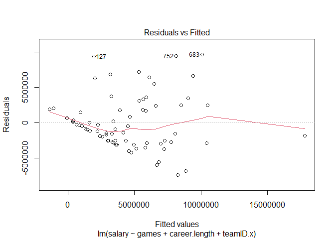<!-- -->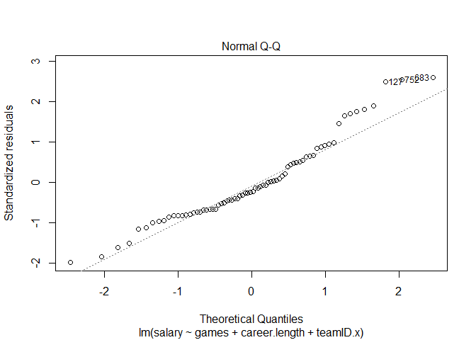<!-- -->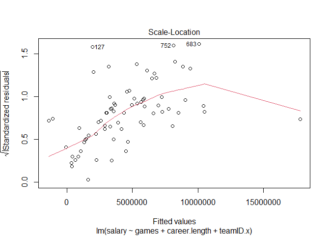<!-- --><!-- -->

## 3.2 Critique model using relevant diagnostics

*Looking at our model* Our final model is
*s**a**l**a**r**y* =  − 157881 + (22993×*g**a**m**e**s*) + (843051×*c**a**r**e**e**r*.*l**e**n**g**t**h*) − (2666045×*T**e**a**m**K**C**A*)

This means that for every incremental increase of - games, then a
players salary goes up by $22,993. - year played then a players salary
goes up by $843,051 and that if a player plays for KCA as opposed to BOS
then their salary decreases by $2,666,045

*Looking at our summary* - There is a problem with our residuals -
residuals should ideally be symmetrical so we would want Q1 and Q3, Min
and Max to be equidistant from 0 and the median to be closer to 0. - We
also learn that only approx 43% of the variance is explained by the
model - our R^2 value. This value is low indicating a poor model. - Our
R^2 is significant determined by a significant F value. The F-ratio
tells us if the variance explained by our model is significantly
different from the one explained by the errors. - All of our
coefficients are significant at the 1% level, other than games (which is
significant at the 5% level). A significant p-value for our coefficients
means they will give us a reliable estimate for salary.

*Looking at our diagnostic plots* plot 1 - residuals vs fitted - ideally
this should look random, if there are some trends this indicated a
problem with the model assumptions. - As we can see there is a grouping
of points suggesting we do not have equal variance.

plot 2 - Q-Q plot - this should be a straight line if the errors are
normally distributed - an S shape or banana shape indicated a different
model needs to be fitted - in our plot the errors are not on the line
and follow more of an s-shape suggesting the necessity of a
transformation

This all indicates we may need to look for a better model or that some
of our assumptions required for ANCOVA are false (reference_11).

False assumptions include: - constant variance - shown to be false in
our diagnostic plots - nonnormality - our dependent variable salary and
many explanatory variables are not normal. - independence in our
Y-variable (salary) - I believe this assumption to be incorrect as
players salaries are not fully independent of each other. There is a
minimum salary of around $300,000 to which our mode leans to - This
minimum was set in 2002 (reference_7) - outliers - MLB salaries have a
minimum but no maximum which allows players to have abnormally large
salaries. (reference_7)

A weakness to our model I have identified is incompleteness - missing
explanatory variables. One variable I am surprised to see missing from
our data is player position. I felt it necessary to improve my knowledge
about baseball, from my research I was able to determine that ‘Starting
pitchers and first basemen are the highest paid in MLB’. I believe that
adding ‘player_position’ as a variable would strengthen our model and
the absence of it is a critical weakness of our model. (reference_6).

## 3.3 Suggest improvements to your model

Statistical tests depend on the assumption of normality - significant
skewness and kurtosis implies are data is not normal therefore we should
apply some sort of transformation to make the data normal. (reference_8)

Coupling the evidence from the diagnostic plots and our preliminary EDA
it is evident that transformation of the explanatory variables are
needed. It is our last resort to transform our dependent variable as
this makes explaining our model more difficult so we will start by
transforming our explanatory variables.

I will apply Tukeys Ladder to find a suitable transformation for our
variables. (reference_9)

``` r
#normality check
hist(my_teams_clean$career.length)
```

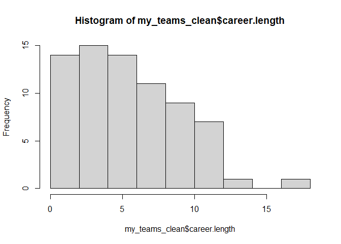<!-- -->

``` r
hist(my_teams_clean$games)
```

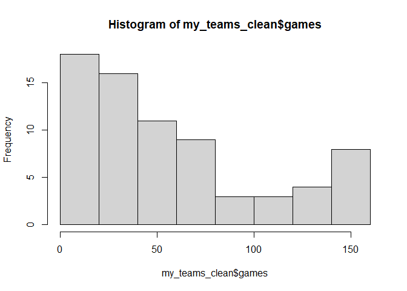<!-- -->

``` r
#tukeys ladder function to help us find a suitable transformation
transformTukey(
  my_teams_clean$career.length,
  start = -10,
  end = 10,
  int = 0.025,
  plotit = TRUE,
  verbose = FALSE,
  quiet = FALSE,
  statistic = 1,
  returnLambda = FALSE
)
```

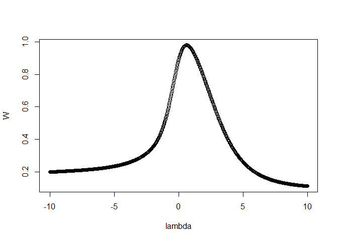<!-- -->

    ## 
    ##     lambda      W Shapiro.p.value
    ## 425    0.6 0.9799          0.3038
    ## 
    ## if (lambda >  0){TRANS = x ^ lambda} 
    ## if (lambda == 0){TRANS = log(x)} 
    ## if (lambda <  0){TRANS = -1 * x ^ lambda}

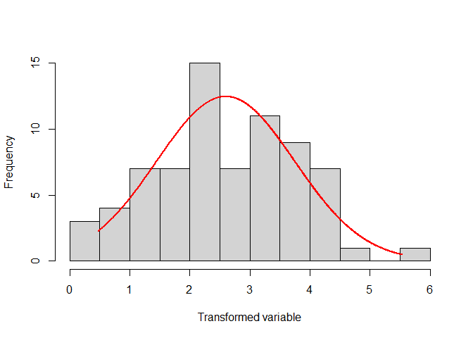<!-- -->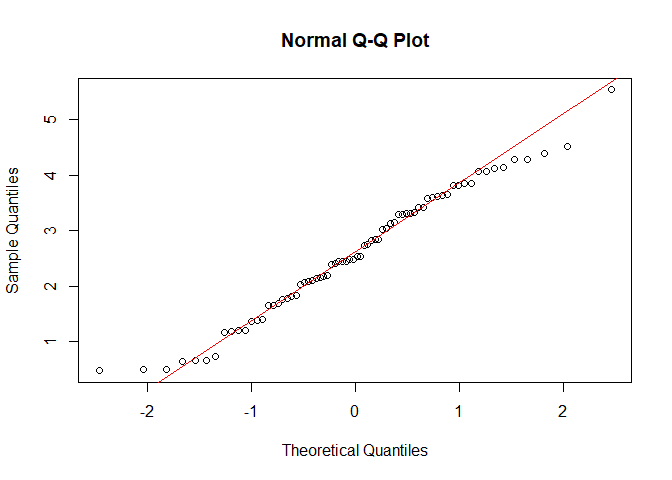<!-- -->

    ##  [1] 0.4972660 0.6670427 1.2058858 1.4000832 3.8464650 3.3165337 2.5408095
    ##  [8] 2.4533439 0.4760246 0.7255947 3.3239148 2.1919926 0.6627299 2.1031726
    ## [15] 2.5416916 3.1436218 2.7260232 3.4167231 2.1656021 2.4051650 3.0250032
    ## [22] 4.1484434 4.2850194 3.4167231 4.0625904 3.2995157 1.1854709 2.0394824
    ## [29] 3.3002568 2.4379595 1.6623008 2.1773575 4.5114429 1.3855948 1.7576518
    ## [36] 2.4524407 1.6832841 1.7879316 1.6599585 4.2756726 3.1275189 2.8159521
    ## [43] 0.6474852 2.0719961 3.3157950 3.6393033 2.1429510 3.6191313 3.6524792
    ## [50] 2.4839215 2.4812335 5.5371730 3.5757511 2.0820870 2.8504105 3.8068493
    ## [57] 4.1223016 1.8277811 3.0406836 2.7511997 2.8512275 3.8524841 2.3895748
    ## [64] 1.1648189 4.3857280 3.8209812 1.3710047 4.0651706 3.5904835 0.4972660
    ## [71] 1.2058858 1.8123536

``` r
#tukeys ladder function to help us find a suitable transformation
transformTukey(
  my_teams_clean$games,
  start = -10,
  end = 10,
  int = 0.025,
  plotit = TRUE,
  verbose = FALSE,
  quiet = FALSE,
  statistic = 1,
  returnLambda = FALSE
)
```

<!-- -->

    ## 
    ##     lambda      W Shapiro.p.value
    ## 414  0.325 0.9728          0.1201
    ## 
    ## if (lambda >  0){TRANS = x ^ lambda} 
    ## if (lambda == 0){TRANS = log(x)} 
    ## if (lambda <  0){TRANS = -1 * x ^ lambda}

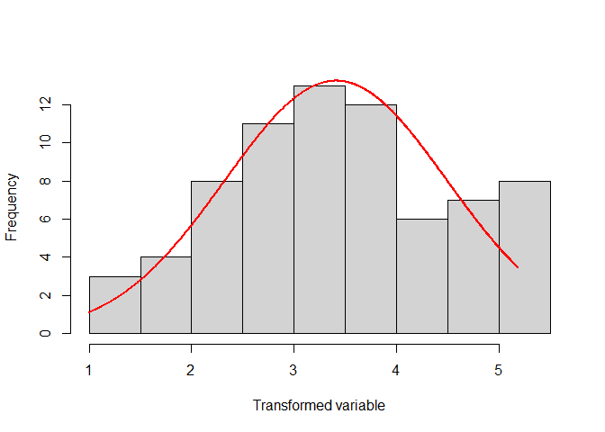<!-- -->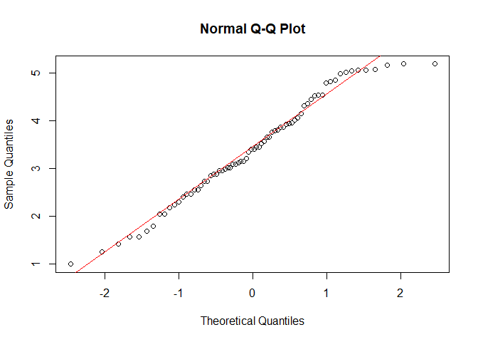<!-- -->

    ##  [1] 3.084422 5.040163 5.161376 4.050422 3.445832 2.558371 3.445832 4.983008
    ##  [9] 4.154361 1.252664 1.790190 1.569168 3.395293 1.687195 3.204781 2.301609
    ## [17] 3.959369 3.783547 3.020400 4.316471 5.073820 2.883144 2.242508 4.524138
    ## [25] 3.020400 3.656183 2.730784 4.014515 3.565868 3.518871 4.852233 5.182789
    ## [33] 4.790293 1.000000 2.846627 1.569168 3.863745 3.343141 2.883144 3.940628
    ## [41] 2.558371 2.411180 1.429106 3.084422 3.921699 5.182789 5.062653 2.179981
    ## [49] 4.437603 2.987304 3.863745 5.051434 4.362716 5.006033 2.953428 4.538230
    ## [57] 4.538230 3.656183 4.815268 3.803927 3.395293 2.042344 2.042344 2.953428
    ## [65] 3.115423 3.145797 2.462289 3.145797 3.762937 2.730784 2.462289 2.647493

``` r
#create a new dataset for our transformed variables
my_teams_transformed <- my_teams_clean

#transform career length
my_teams_transformed$career.length <- (my_teams_transformed$career.length)^0.6

#transform games
my_teams_transformed$games <- (my_teams_transformed$games)^0.325
```

I will now re-create our model using our transformed variables.

``` r
#firstly build a maximal model with highly correlated explanatory variables removed
model_transformed <- lm(salary~games+weight+height+career.length+bats+age+hitRate+teamID.x, data = my_teams_transformed)

summary(model_transformed)
```

    ## 
    ## Call:
    ## lm(formula = salary ~ games + weight + height + career.length + 
    ##     bats + age + hitRate + teamID.x, data = my_teams_transformed)
    ## 
    ## Residuals:
    ##      Min       1Q   Median       3Q      Max 
    ## -6132317 -2710515  -358235  2454890 10128135 
    ## 
    ## Coefficients:
    ##               Estimate Std. Error t value  Pr(>|t|)    
    ## (Intercept)    7261086   14422642   0.503   0.61643    
    ## games           919430     544390   1.689   0.09626 .  
    ## weight           37582      25496   1.474   0.14553    
    ## height         -214482     210537  -1.019   0.31229    
    ## career.length  3145886     685497   4.589 0.0000222 ***
    ## batsL          -589728    1928880  -0.306   0.76083    
    ## batsR           737958    1773005   0.416   0.67869    
    ## age            -186167     186942  -0.996   0.32319    
    ## hitRate        1637422    3742048   0.438   0.66322    
    ## teamID.xKCA   -3058497     992480  -3.082   0.00307 ** 
    ## ---
    ## Signif. codes:  0 '***' 0.001 '**' 0.01 '*' 0.05 '.' 0.1 ' ' 1
    ## 
    ## Residual standard error: 3865000 on 62 degrees of freedom
    ## Multiple R-squared:  0.4731, Adjusted R-squared:  0.3966 
    ## F-statistic: 6.185 on 9 and 62 DF,  p-value: 0.000003549

``` r
#check diagnostic plots
plot(model_transformed)
```

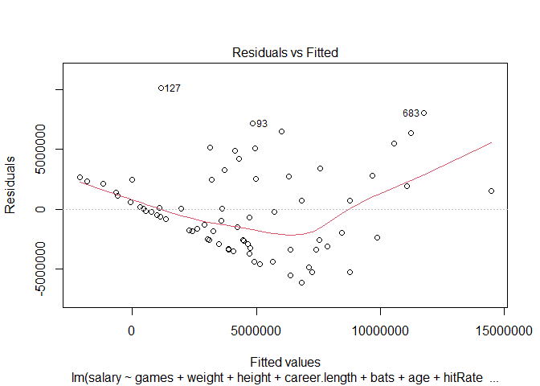<!-- -->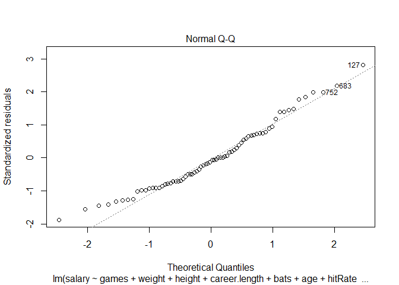<!-- -->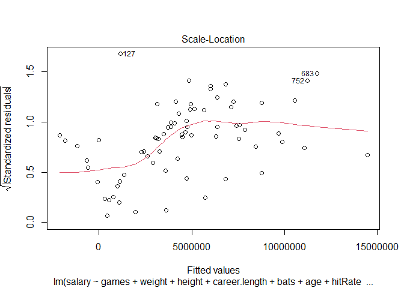<!-- -->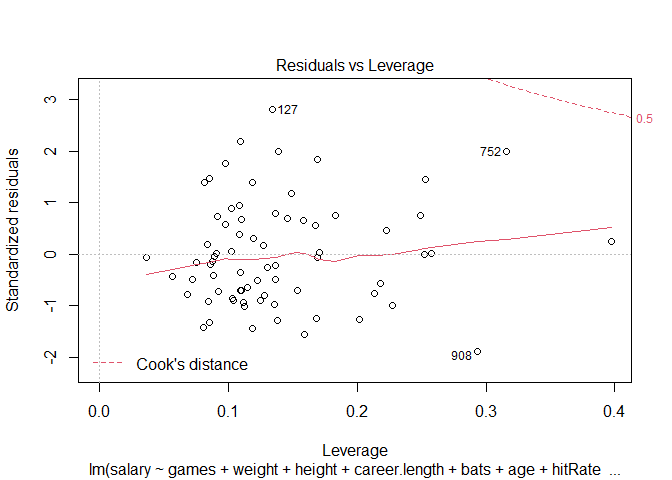<!-- -->

``` r
#use the step function to find our final model
step(model_transformed)
```

    ## Start:  AIC=2193.37
    ## salary ~ games + weight + height + career.length + bats + age + 
    ##     hitRate + teamID.x
    ## 
    ##                 Df       Sum of Sq              RSS    AIC
    ## - bats           2  21585879785862  947962759190703 2191.0
    ## - hitRate        1   2860870941784  929237750346625 2191.6
    ## - age            1  14818012372442  941194891777283 2192.5
    ## - height         1  15506681251282  941883560656123 2192.6
    ## <none>                              926376879404841 2193.4
    ## - weight         1  32464836804337  958841716209178 2193.8
    ## - games          1  42619895012164  968996774417005 2194.6
    ## - teamID.x       1 141895648296618 1068272527701459 2201.6
    ## - career.length  1 314681714125467 1241058593530308 2212.4
    ## 
    ## Step:  AIC=2191.02
    ## salary ~ games + weight + height + career.length + age + hitRate + 
    ##     teamID.x
    ## 
    ##                 Df       Sum of Sq              RSS    AIC
    ## - hitRate        1   5172005409970  953134764600672 2189.4
    ## - age            1  10458054459348  958420813650050 2189.8
    ## - height         1  15487542062778  963450301253481 2190.2
    ## <none>                              947962759190703 2191.0
    ## - games          1  32995408624805  980958167815508 2191.5
    ## - weight         1  37148835520352  985111594711054 2191.8
    ## - teamID.x       1 134357335394263 1082320094584966 2198.6
    ## - career.length  1 296270157414026 1244232916604729 2208.6
    ## 
    ## Step:  AIC=2189.42
    ## salary ~ games + weight + height + career.length + age + teamID.x
    ## 
    ##                 Df       Sum of Sq              RSS    AIC
    ## - age            1   9323355930368  962458120531041 2188.1
    ## - height         1  15274892294161  968409656894833 2188.6
    ## <none>                              953134764600672 2189.4
    ## - weight         1  42351385261666  995486149862338 2190.6
    ## - games          1  66655853736946 1019790618337619 2192.3
    ## - teamID.x       1 140324658273299 1093459422873972 2197.3
    ## - career.length  1 295891269091450 1249026033692122 2206.9
    ## 
    ## Step:  AIC=2188.12
    ## salary ~ games + weight + height + career.length + teamID.x
    ## 
    ##                 Df       Sum of Sq              RSS    AIC
    ## - height         1  15130191298650  977588311829690 2187.2
    ## <none>                              962458120531041 2188.1
    ## - weight         1  46191094633904 1008649215164944 2189.5
    ## - games          1  84154618119457 1046612738650498 2192.2
    ## - teamID.x       1 132146390096552 1094604510627592 2195.4
    ## - career.length  1 540913515853725 1503371636384766 2218.2
    ## 
    ## Step:  AIC=2187.24
    ## salary ~ games + weight + career.length + teamID.x
    ## 
    ##                 Df       Sum of Sq              RSS    AIC
    ## <none>                              977588311829691 2187.2
    ## - weight         1  31655404156595 1009243715986286 2187.5
    ## - games          1  98533923905462 1076122235735153 2192.2
    ## - teamID.x       1 140903157457780 1118491469287470 2194.9
    ## - career.length  1 526010975002237 1503599286831927 2216.2

    ## 
    ## Call:
    ## lm(formula = salary ~ games + weight + career.length + teamID.x, 
    ##     data = my_teams_transformed)
    ## 
    ## Coefficients:
    ##   (Intercept)          games         weight  career.length    teamID.xKCA  
    ##     -11128013        1116728          31203        2530554       -2970987

``` r
#final model taken from our step function
model_transformed_2 <- lm(formula = salary ~ games + weight + career.length + teamID.x, data = my_teams_transformed)

summary(model_transformed_2)
```

    ## 
    ## Call:
    ## lm(formula = salary ~ games + weight + career.length + teamID.x, 
    ##     data = my_teams_transformed)
    ## 
    ## Residuals:
    ##      Min       1Q   Median       3Q      Max 
    ## -7572979 -2626709  -816776  1992675 10470492 
    ## 
    ## Coefficients:
    ##                Estimate Std. Error t value     Pr(>|t|)    
    ## (Intercept)   -11128013    4823414  -2.307      0.02415 *  
    ## games           1116728     429730   2.599      0.01150 *  
    ## weight            31203      21184   1.473      0.14545    
    ## career.length   2530555     421463   6.004 0.0000000872 ***
    ## teamID.xKCA    -2970987     956051  -3.108      0.00277 ** 
    ## ---
    ## Signif. codes:  0 '***' 0.001 '**' 0.01 '*' 0.05 '.' 0.1 ' ' 1
    ## 
    ## Residual standard error: 3820000 on 67 degrees of freedom
    ## Multiple R-squared:  0.444,  Adjusted R-squared:  0.4108 
    ## F-statistic: 13.37 on 4 and 67 DF,  p-value: 0.00000004587

``` r
plot(model_transformed_2)
```

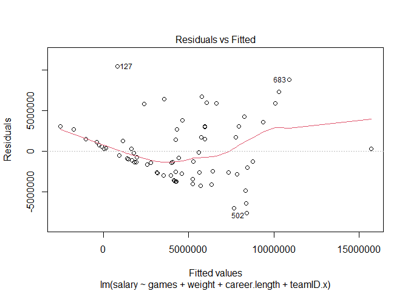<!-- -->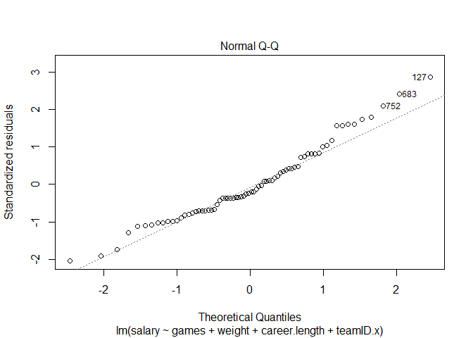<!-- -->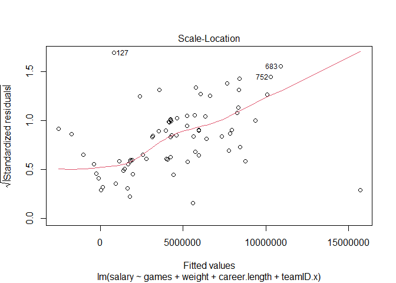<!-- -->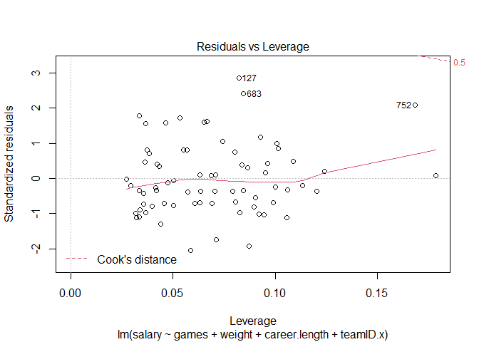<!-- -->

*Looking at our diagnostic plots* Our plots do not show significant
improvement. I will now transform our dependent variable salary.

Salary has a sever positive skew - 1.22. After applying both Tukey’s
Ladder and log transformations to salary I found that using a log
transformation produced the better result for our model in terms of R^2
so I choose to use log.

``` r
#visualise salary with a density curve overlayed
gghistogram(my_teams_clean, x = "salary", y = "..density..", fill = "steelblue",bins = 20, add_density = TRUE) + ggtitle('Salary Histogram with Density Curve')
```

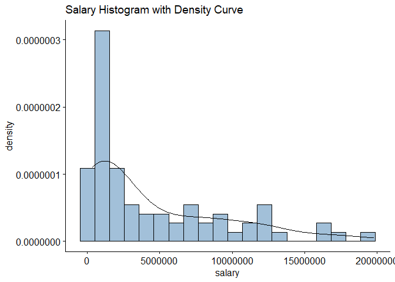<!-- -->

``` r
#we can use the skewness function found in the e1071 library
skewness(my_teams_clean$salary, na.rm = TRUE)
```

    ## [1] 1.200789

``` r
kurtosis(my_teams_clean$salary)
```

    ## [1] 0.4458116

``` r
#from the output, the significant p-value tells us that salary is not normally distributed
shapiro.test(my_teams_clean$salary)
```

    ## 
    ##  Shapiro-Wilk normality test
    ## 
    ## data:  my_teams_clean$salary
    ## W = 0.80328, p-value = 0.00000002105

``` r
#transform salary
my_teams_transformed$salary <- log(my_teams_transformed$salary)

#create a quantiles-quantiles plot to examine the change in normality
ggqqplot(my_teams_clean$salary)
```

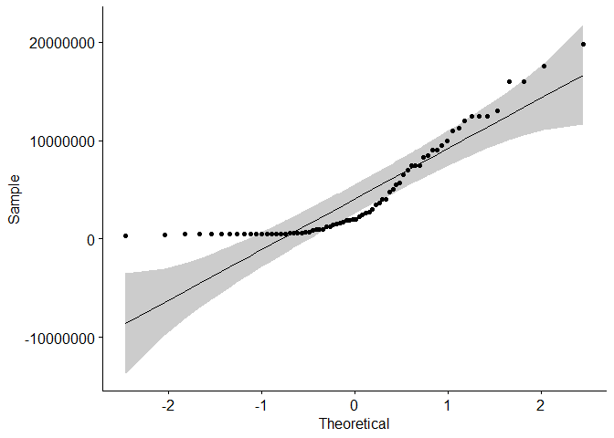<!-- -->

``` r
ggqqplot(my_teams_transformed$salary)
```

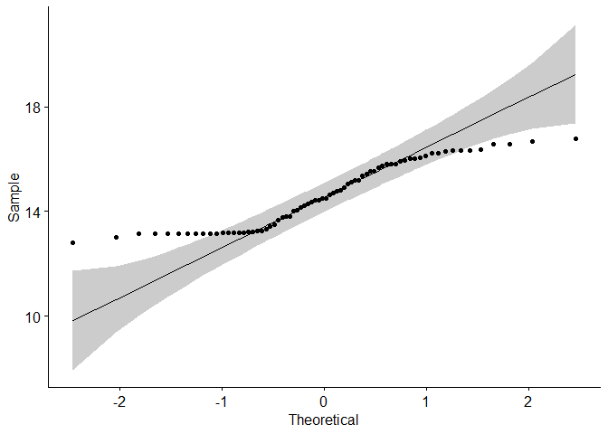<!-- -->

``` r
model_transformed_3 <- lm(salary~games+weight+height+career.length+bats+age+hitRate+teamID.x, data = my_teams_transformed)
summary(model_transformed_3)
```

    ## 
    ## Call:
    ## lm(formula = salary ~ games + weight + height + career.length + 
    ##     bats + age + hitRate + teamID.x, data = my_teams_transformed)
    ## 
    ## Residuals:
    ##     Min      1Q  Median      3Q     Max 
    ## -1.8817 -0.5467 -0.1173  0.6262  2.8837 
    ## 
    ## Coefficients:
    ##                Estimate Std. Error t value    Pr(>|t|)    
    ## (Intercept)   15.122501   3.444402   4.390 0.000044885 ***
    ## games          0.229080   0.130011   1.762       0.083 .  
    ## weight         0.002560   0.006089   0.420       0.676    
    ## height        -0.030930   0.050280  -0.615       0.541    
    ## career.length  0.895198   0.163710   5.468 0.000000863 ***
    ## batsL         -0.252446   0.460653  -0.548       0.586    
    ## batsR          0.041502   0.423427   0.098       0.922    
    ## age           -0.057527   0.044645  -1.289       0.202    
    ## hitRate        0.111456   0.893672   0.125       0.901    
    ## teamID.xKCA   -0.343636   0.237023  -1.450       0.152    
    ## ---
    ## Signif. codes:  0 '***' 0.001 '**' 0.01 '*' 0.05 '.' 0.1 ' ' 1
    ## 
    ## Residual standard error: 0.9231 on 62 degrees of freedom
    ## Multiple R-squared:  0.5276, Adjusted R-squared:  0.459 
    ## F-statistic: 7.694 on 9 and 62 DF,  p-value: 0.0000001716

``` r
step(model_transformed_3)
```

    ## Start:  AIC=-2.28
    ## salary ~ games + weight + height + career.length + bats + age + 
    ##     hitRate + teamID.x
    ## 
    ##                 Df Sum of Sq    RSS     AIC
    ## - bats           2    1.0310 53.866 -4.8914
    ## - hitRate        1    0.0133 52.849 -4.2647
    ## - weight         1    0.1506 52.986 -4.0778
    ## - height         1    0.3225 53.158 -3.8447
    ## - age            1    1.4149 54.250 -2.3800
    ## <none>                       52.835 -2.2828
    ## - teamID.x       1    1.7912 54.627 -1.8823
    ## - games          1    2.6457 55.481 -0.7647
    ## - career.length  1   25.4814 78.317 24.0550
    ## 
    ## Step:  AIC=-4.89
    ## salary ~ games + weight + height + career.length + age + hitRate + 
    ##     teamID.x
    ## 
    ##                 Df Sum of Sq    RSS     AIC
    ## - hitRate        1    0.0675 53.934 -6.8012
    ## - weight         1    0.2628 54.129 -6.5410
    ## - height         1    0.4015 54.268 -6.3567
    ## - age            1    1.1254 54.992 -5.4026
    ## <none>                       53.866 -4.8914
    ## - teamID.x       1    1.5878 55.454 -4.7997
    ## - games          1    2.1271 55.994 -4.1030
    ## - career.length  1   24.6616 78.528 20.2489
    ## 
    ## Step:  AIC=-6.8
    ## salary ~ games + weight + height + career.length + age + teamID.x
    ## 
    ##                 Df Sum of Sq    RSS     AIC
    ## - weight         1    0.3110 54.245 -8.3872
    ## - height         1    0.3976 54.332 -8.2724
    ## - age            1    1.0872 55.021 -7.3643
    ## <none>                       53.934 -6.8012
    ## - teamID.x       1    1.6613 55.595 -6.6169
    ## - games          1    3.5204 57.454 -4.2486
    ## - career.length  1   24.6495 78.583 18.2996
    ## 
    ## Step:  AIC=-8.39
    ## salary ~ games + height + career.length + age + teamID.x
    ## 
    ##                 Df Sum of Sq    RSS      AIC
    ## - height         1    0.1742 54.419 -10.1563
    ## - age            1    1.1987 55.444  -8.8135
    ## <none>                       54.245  -8.3872
    ## - teamID.x       1    1.6059 55.851  -8.2866
    ## - games          1    3.4159 57.661  -5.9902
    ## - career.length  1   25.3163 79.561  17.1900
    ## 
    ## Step:  AIC=-10.16
    ## salary ~ games + career.length + age + teamID.x
    ## 
    ##                 Df Sum of Sq    RSS      AIC
    ## - age            1    1.1540 55.573 -10.6455
    ## <none>                       54.419 -10.1563
    ## - teamID.x       1    1.7543 56.174  -9.8719
    ## - games          1    3.9134 58.333  -7.1564
    ## - career.length  1   25.2886 79.708  15.3225
    ## 
    ## Step:  AIC=-10.65
    ## salary ~ games + career.length + teamID.x
    ## 
    ##                 Df Sum of Sq    RSS      AIC
    ## - teamID.x       1     1.321 56.894 -10.9540
    ## <none>                       55.573 -10.6455
    ## - games          1     5.247 60.820  -6.1496
    ## - career.length  1    43.393 98.967  28.9044
    ## 
    ## Step:  AIC=-10.95
    ## salary ~ games + career.length
    ## 
    ##                 Df Sum of Sq    RSS      AIC
    ## <none>                       56.894 -10.9540
    ## - games          1     4.945 61.839  -6.9534
    ## - career.length  1    42.703 99.597  27.3615

    ## 
    ## Call:
    ## lm(formula = salary ~ games + career.length, data = my_teams_transformed)
    ## 
    ## Coefficients:
    ##   (Intercept)          games  career.length  
    ##       12.0048         0.2476         0.6855

``` r
model_transformed_final <- lm(formula = salary ~ games + career.length, data = my_teams_transformed)
summary(model_transformed_final)
```

    ## 
    ## Call:
    ## lm(formula = salary ~ games + career.length, data = my_teams_transformed)
    ## 
    ## Residuals:
    ##      Min       1Q   Median       3Q      Max 
    ## -2.25845 -0.62379 -0.09897  0.50590  2.87793 
    ## 
    ## Coefficients:
    ##               Estimate Std. Error t value             Pr(>|t|)    
    ## (Intercept)   12.00478    0.39969  30.036 < 0.0000000000000002 ***
    ## games          0.24763    0.10112   2.449               0.0169 *  
    ## career.length  0.68547    0.09525   7.196       0.000000000585 ***
    ## ---
    ## Signif. codes:  0 '***' 0.001 '**' 0.01 '*' 0.05 '.' 0.1 ' ' 1
    ## 
    ## Residual standard error: 0.908 on 69 degrees of freedom
    ## Multiple R-squared:  0.4913, Adjusted R-squared:  0.4766 
    ## F-statistic: 33.32 on 2 and 69 DF,  p-value: 0.0000000000745

``` r
plot(model_transformed_final)
```

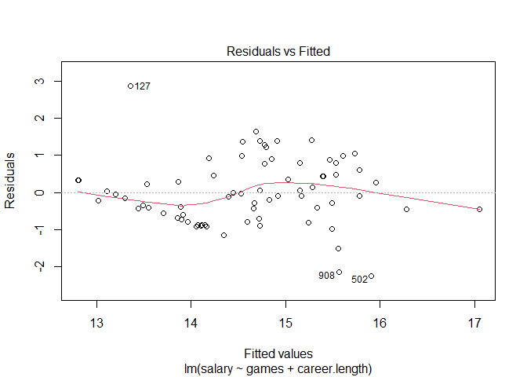<!-- -->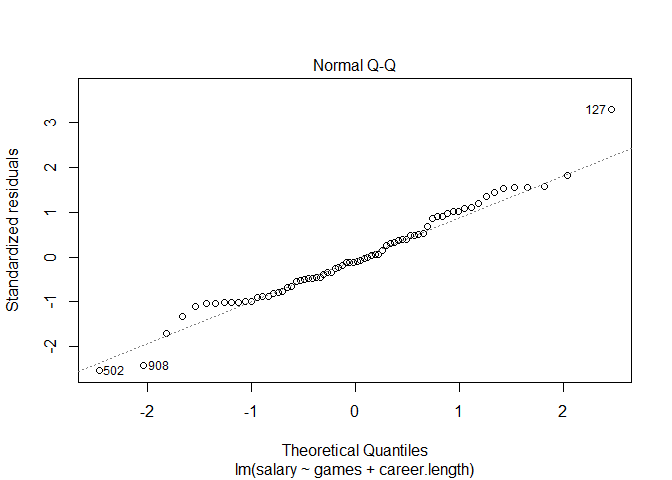<!-- -->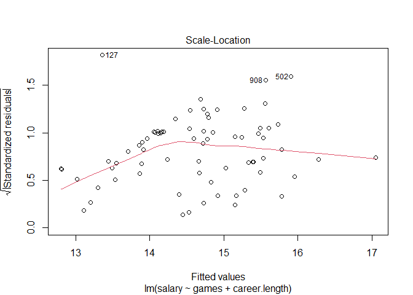<!-- -->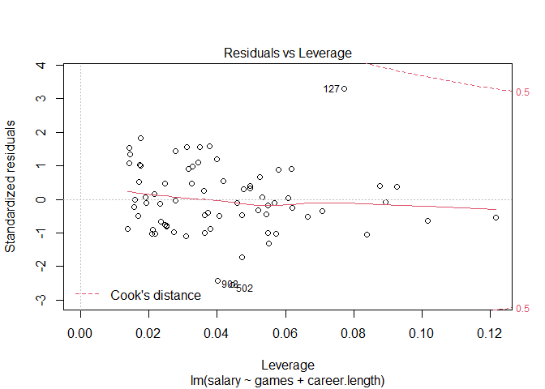<!-- -->

*Looking at our diagnostic plots* Our diagnostic plots look the best for
this model.

*Looking at our model* Our final model is
*l**o**g*(*s**a**l**a**r**y*) = 12.00478 + (0.24763×*g**a**m**e**s*) + (0.68547×*c**a**r**e**e**r*.*l**e**n**g**t**h*)
We can see that this model hasn’t included teamID - a significant
covariate from our non-transformed model.

*Looking at our summary* - Our residuals look more symmetrical and
centered around 0. - We also learn that 0.4913 of the variance is
explained by the model compared with 0.4394 from our previous model. -
Our F-statistic is larger than in our previous model and significant. -
Our coefficients are all significant.

Overall our R^2 is still very low - this model could be argued to be a
better fit to our data, but transforming Y makes the interpretation of
our results difficult. Going by rules of Occams Razor and Parsimony, I
would keep things simple and stick with our previous model, however both
models do not do a good job of predicting salary.

# 4. Extension work

## 4.1 Model the likelihood of a player having scored a Hit (using the hit.ind variable provided).

#Plan

-   Our dependent variable is binary - ‘no’ or ‘yes’ - we will use a GLM
    model to help us model the data, specifically logistic regression -
    which will help us understand how the explanatory variables affect
    the probability of a ‘no’ or a ‘yes’ in hit.ind.
-   I will perform numerical and graphical explorations of the data -
    summary and boxplots for example
-   We have the knowledge of collinearity from our last EDA so we do not
    need to check again here, however, if we didn’t then I would
    re-perform the pairs.plot and using scatter plots checking for
    linearity.
-   I will then build a maximal model and use the step function to find
    a minimal model

I will use the dataset my_teams_6 that includes hit.ind variable and
then clean the dataset by removing the NA values. I have removed hitRate
as it is a factor created using hit.ind our dependent variable.

``` r
#remove NA values
my_teams_hit <- na.omit(my_teams_6)

#remove hitRate
my_teams_hit <- subset(my_teams_hit, select = -hitRate)

#confirm the dependent variable is binary
table(my_teams_hit$hit.ind)
```

    ## 
    ##  no yes 
    ##  37  35

``` r
#creates a table of team and hit.ind with the columns summed
addmargins(table(my_teams_hit$teamID.x, my_teams_hit$hit.ind))
```

    ##      
    ##       no yes Sum
    ##   BOS 20  19  39
    ##   KCA 17  16  33
    ##   Sum 37  35  72

We can then start to explore visually

From the boxplots below we learn that - Players earning larger salaries
are more likely to have made a hit - Players that play more games are
more likely to have made a hit - Players age does not seem to have a
significant effect either way - Players career length does not seem to
have a significant effect either way

``` r
#boxplot of salary vs hit.ind
ggplot(my_teams_hit, aes(x = hit.ind, y = salary)) + geom_boxplot(aes(fill = hit.ind))  + ggtitle('Salary by Hit.Ind') + xlab('Hit.Ind') + ylab('Salary') + theme_classic()
```

<!-- -->

``` r
ggplot(my_teams_hit, aes(x = hit.ind, y = games)) + geom_boxplot(aes(fill = hit.ind))  + ggtitle('Games by Hit.Ind') + xlab('Hit.Ind') + ylab('Games') + theme_classic()
```

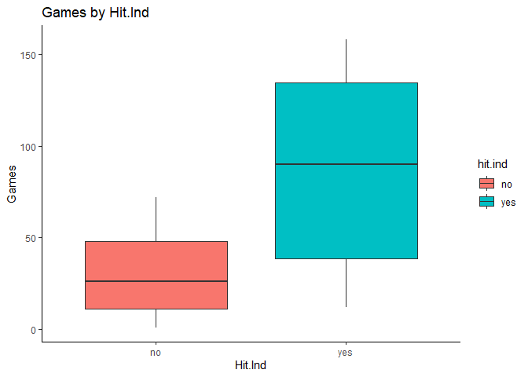<!-- -->

``` r
ggplot(my_teams_hit, aes(x = hit.ind, y = age)) + geom_boxplot(aes(fill = hit.ind))  + ggtitle('Age by Hit.Ind') + xlab('Hit.Ind') + ylab('Age') + theme_classic()
```

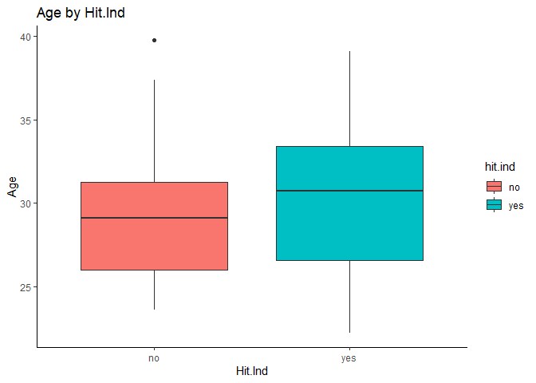<!-- -->

``` r
ggplot(my_teams_hit, aes(x = hit.ind, y = career.length)) + geom_boxplot(aes(fill = hit.ind))  + ggtitle('Career Length by Hit.Ind') + xlab('Hit.Ind') + ylab('Career Length') + theme_classic()
```

<!-- -->
We know from our previous model we have highly correlated pairs of
explanatory variables so as before I will remove AB, RBI, hits and runs
leaving just games.

Note that there are no diagnostic plots in logistic regression as the
assumptions that we were checking for in linear models are not relevant.

``` r
#we create a maximal model
logit.model <- glm(hit.ind~games+weight+height+career.length+bats+age+teamID.x+ salary, data = my_teams_hit, family = binomial)
summary(logit.model)
```

    ## 
    ## Call:
    ## glm(formula = hit.ind ~ games + weight + height + career.length + 
    ##     bats + age + teamID.x + salary, family = binomial, data = my_teams_hit)
    ## 
    ## Deviance Residuals: 
    ##     Min       1Q   Median       3Q      Max  
    ## -1.6571  -0.6386  -0.1769   0.4525   2.0276  
    ## 
    ## Coefficients:
    ##                     Estimate     Std. Error z value Pr(>|z|)    
    ## (Intercept)    4.86483919277  9.55759103368   0.509   0.6108    
    ## games          0.05012907210  0.01386420969   3.616   0.0003 ***
    ## weight         0.01087084573  0.01998411685   0.544   0.5865    
    ## height        -0.15477107493  0.14806894876  -1.045   0.2959    
    ## career.length  0.07972194938  0.17496571011   0.456   0.6486    
    ## batsL         -3.11141768944  1.55752519156  -1.998   0.0458 *  
    ## batsR         -1.77986079389  1.39466677041  -1.276   0.2019    
    ## age            0.11004005090  0.12739675765   0.864   0.3877    
    ## teamID.xKCA   -0.84771968499  0.77558613656  -1.093   0.2744    
    ## salary         0.00000003808  0.00000010136   0.376   0.7071    
    ## ---
    ## Signif. codes:  0 '***' 0.001 '**' 0.01 '*' 0.05 '.' 0.1 ' ' 1
    ## 
    ## (Dispersion parameter for binomial family taken to be 1)
    ## 
    ##     Null deviance: 99.758  on 71  degrees of freedom
    ## Residual deviance: 57.248  on 62  degrees of freedom
    ## AIC: 77.248
    ## 
    ## Number of Fisher Scoring iterations: 6

``` r
#AIC step function model 
step(logit.model)
```

    ## Start:  AIC=77.25
    ## hit.ind ~ games + weight + height + career.length + bats + age + 
    ##     teamID.x + salary
    ## 
    ##                 Df Deviance     AIC
    ## - salary         1   57.390  75.390
    ## - career.length  1   57.456  75.456
    ## - weight         1   57.547  75.547
    ## - age            1   58.008  76.008
    ## - height         1   58.378  76.378
    ## - teamID.x       1   58.497  76.497
    ## <none>               57.248  77.248
    ## - bats           2   62.482  78.482
    ## - games          1   87.469 105.469
    ## 
    ## Step:  AIC=75.39
    ## hit.ind ~ games + weight + height + career.length + bats + age + 
    ##     teamID.x
    ## 
    ##                 Df Deviance     AIC
    ## - weight         1   57.703  73.703
    ## - career.length  1   57.926  73.926
    ## - age            1   58.067  74.067
    ## - height         1   58.603  74.603
    ## - teamID.x       1   58.932  74.932
    ## <none>               57.390  75.390
    ## - bats           2   63.073  77.073
    ## - games          1   90.438 106.438
    ## 
    ## Step:  AIC=73.7
    ## hit.ind ~ games + height + career.length + bats + age + teamID.x
    ## 
    ##                 Df Deviance     AIC
    ## - career.length  1   58.247  72.247
    ## - age            1   58.279  72.279
    ## - height         1   58.610  72.610
    ## - teamID.x       1   59.145  73.145
    ## <none>               57.703  73.703
    ## - bats           2   63.776  75.776
    ## - games          1   90.438 104.438
    ## 
    ## Step:  AIC=72.25
    ## hit.ind ~ games + height + bats + age + teamID.x
    ## 
    ##            Df Deviance     AIC
    ## - height    1   58.943  70.943
    ## - teamID.x  1   59.245  71.245
    ## <none>          58.247  72.247
    ## - age       1   61.464  73.464
    ## - bats      2   63.947  73.947
    ## - games     1   93.503 105.503
    ## 
    ## Step:  AIC=70.94
    ## hit.ind ~ games + bats + age + teamID.x
    ## 
    ##            Df Deviance     AIC
    ## - teamID.x  1   60.228  70.228
    ## <none>          58.943  70.943
    ## - age       1   61.894  71.894
    ## - bats      2   65.289  73.289
    ## - games     1   95.456 105.456
    ## 
    ## Step:  AIC=70.23
    ## hit.ind ~ games + bats + age
    ## 
    ##         Df Deviance     AIC
    ## <none>       60.228  70.228
    ## - age    1   62.789  70.789
    ## - bats   2   66.274  72.274
    ## - games  1   95.480 103.480

    ## 
    ## Call:  glm(formula = hit.ind ~ games + bats + age, family = binomial, 
    ##     data = my_teams_hit)
    ## 
    ## Coefficients:
    ## (Intercept)        games        batsL        batsR          age  
    ##    -4.49398      0.04874     -3.23351     -1.96471      0.13548  
    ## 
    ## Degrees of Freedom: 71 Total (i.e. Null);  67 Residual
    ## Null Deviance:       99.76 
    ## Residual Deviance: 60.23     AIC: 70.23

``` r
#select the MAM produced by the step function
logit.model.step <- glm(formula = hit.ind ~ games + bats + age, family = binomial, data = my_teams_hit)

summary(logit.model.step)
```

    ## 
    ## Call:
    ## glm(formula = hit.ind ~ games + bats + age, family = binomial, 
    ##     data = my_teams_hit)
    ## 
    ## Deviance Residuals: 
    ##     Min       1Q   Median       3Q      Max  
    ## -1.6306  -0.6117  -0.2331   0.5076   1.9071  
    ## 
    ## Coefficients:
    ##             Estimate Std. Error z value  Pr(>|z|)    
    ## (Intercept) -4.49398    2.91196  -1.543    0.1228    
    ## games        0.04874    0.01243   3.920 0.0000885 ***
    ## batsL       -3.23351    1.47409  -2.194    0.0283 *  
    ## batsR       -1.96471    1.29292  -1.520    0.1286    
    ## age          0.13548    0.08754   1.548    0.1217    
    ## ---
    ## Signif. codes:  0 '***' 0.001 '**' 0.01 '*' 0.05 '.' 0.1 ' ' 1
    ## 
    ## (Dispersion parameter for binomial family taken to be 1)
    ## 
    ##     Null deviance: 99.758  on 71  degrees of freedom
    ## Residual deviance: 60.228  on 67  degrees of freedom
    ## AIC: 70.228
    ## 
    ## Number of Fisher Scoring iterations: 6

From the summary we see age is not significant and therefore not a good
predictor so I remove it and create our final model

``` r
#final model is the step model with age removed as it is not significant meaning it is a bad predictor
logit.model.final <- glm(formula = hit.ind ~ games + bats, family = binomial, data = my_teams_hit)

summary(logit.model.final)
```

    ## 
    ## Call:
    ## glm(formula = hit.ind ~ games + bats, family = binomial, data = my_teams_hit)
    ## 
    ## Deviance Residuals: 
    ##     Min       1Q   Median       3Q      Max  
    ## -1.6879  -0.7291  -0.2606   0.5086   1.9371  
    ## 
    ## Coefficients:
    ##             Estimate Std. Error z value Pr(>|z|)    
    ## (Intercept) -0.46545    1.26678  -0.367 0.713300    
    ## games        0.04765    0.01236   3.856 0.000115 ***
    ## batsL       -3.16852    1.44840  -2.188 0.028699 *  
    ## batsR       -1.81627    1.26754  -1.433 0.151881    
    ## ---
    ## Signif. codes:  0 '***' 0.001 '**' 0.01 '*' 0.05 '.' 0.1 ' ' 1
    ## 
    ## (Dispersion parameter for binomial family taken to be 1)
    ## 
    ##     Null deviance: 99.758  on 71  degrees of freedom
    ## Residual deviance: 62.789  on 68  degrees of freedom
    ## AIC: 70.789
    ## 
    ## Number of Fisher Scoring iterations: 5

*From the Summary we can see* - We can see that this model has
significant coefficients. Number of games played is significant at the
1% level Batting with a left hand is significant at the 5% level Batting
with a right hand is not significant

-   Deviance being a measure of the goodness of fit of our generalised
    linear model. Our residual deviance is lower than our Null deviance
    indicating the addition of our predictors helps us make better
    predictions for hit.ind. (reference_16)

For bats = L:
$log(\\frac{p}{1-p})=-0.47+0.0048 \\times \\text{games} - (3.17 \\times 1) -(1.82 \\times 0)$

For bats = R:
$log(\\frac{p}{1-p})=-0.47+0.0048 \\times \\text{games}- (3.17 \\times 0) -(1.82 \\times 1)$

``` r
#the coefficients are the same as in linear models except they are in terms of the log(odds) so we exponent them to return them to regular values
exp(coef(logit.model.final))
```

    ## (Intercept)       games       batsL       batsR 
    ##  0.62785201  1.04880575  0.04206584  0.16263063

``` r
#odds ratio of having a hit
exp(cbind(OR=coef(logit.model.final), confint(logit.model.final)))
```

    ## Waiting for profiling to be done...

    ##                     OR       2.5 %    97.5 %
    ## (Intercept) 0.62785201 0.059170270 14.219806
    ## games       1.04880575 1.027444141  1.079269
    ## batsL       0.04206584 0.001398243  0.566939
    ## batsR       0.16263063 0.007057194  1.607477

And we interpret the odds ratio as: - Playing more games increases your
odds of having a hit - Hitting with only your left or right hand lowers
your odds of having a hit

``` r
#predict the probability of hit.ind from the model and add it to our dataset
my_teams_hit$phit<-predict(logit.model.final, type="response")
head(my_teams_hit)
```

    ##     playerID teamID.x games runs hits  AB RBI weight height   salary
    ## 45 barnema01      BOS    32    0    0   0   0    210     76   508500
    ## 64 bettsmo01      BOS   145   92  174 597  77    180     69   514500
    ## 72 bogaexa01      BOS   156   84  196 613  81    210     73   543000
    ## 81 bradlja02      BOS    74   43   55 221  43    200     70   528000
    ## 84 breslcr01      BOS    45    0    0   0   0    190     72  2000000
    ## 93 buchhcl01      BOS    18    0    0   6   0    190     75 12000000
    ##    career.length bats      age hit.ind       phit
    ## 45     0.3121150    R 24.54209      no 0.31932921
    ## 64     0.5092402    R 22.23409     yes 0.99031874
    ## 72     1.3661875    R 22.25051     yes 0.99424554
    ## 81     1.7522245    L 24.70363     yes 0.47309800
    ## 84     9.4428474    L 34.39836      no 0.18397818
    ## 93     7.3757700    L 30.38193      no 0.05862217

``` r
#to draw a graph with our predictions (reference 15)
predicted.data <- data.frame(probability.of.hit.ind = logit.model.step$fitted.values, hit.ind = my_teams_hit$hit.ind)

predicted.data <- predicted.data[order(predicted.data$probability.of.hit.ind, decreasing = FALSE),]

predicted.data$rank <- 1:nrow(predicted.data)

ggplot(data = predicted.data, aes(x= rank, y=probability.of.hit.ind)) + geom_point(aes(color = hit.ind), alpha =1, shape = 4, stroke = 2) + xlab('index') + ylab('Predicted probability of getting a hit')
```

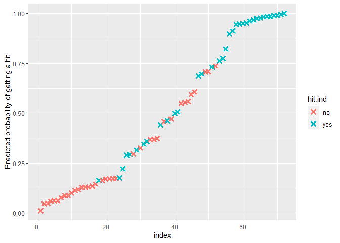<!-- -->
This graph shows us that most of the players predicted to get a hit (if
we set our threshold to be \> 0.5) did and most players that were
predicted not to get a hit didn’t, however there are cases several cases
where prediction and result did not match questioning the strength of
our model.

Another approach is to use a Decision tree (reference_17)

``` r
dtree <- rpart(hit.ind~games+age, data = my_teams_hit)
rpart.plot(dtree)
```

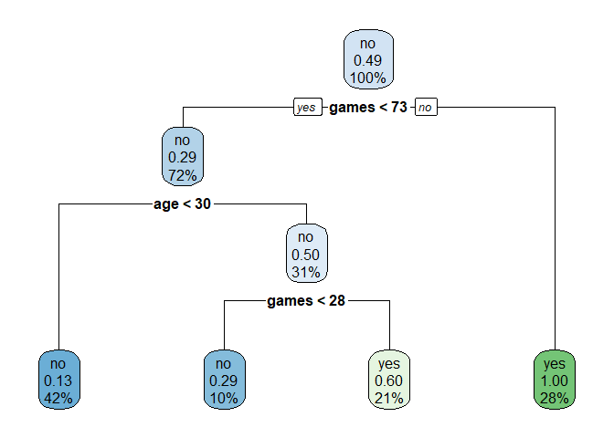<!-- -->

From the output we learn that: - Every player that has played 73 games
and above has a hit. - From then we learn any player that has played
less than 73 games and is under 30 years old has not made a hit. - Any
player over 30 and played less than 28 games has not made a hit while
players who have played between 28 and 72 games over 30 have made a hit.

We can then use a confusion matrix (reference_18) to test the strength
of our model.

``` r
pred = predict(dtree, type='class')
confusionMatrix(pred, my_teams_hit$hit.ind)
```

    ## Confusion Matrix and Statistics
    ## 
    ##           Reference
    ## Prediction no yes
    ##        no  31   6
    ##        yes  6  29
    ##                                          
    ##                Accuracy : 0.8333         
    ##                  95% CI : (0.727, 0.9108)
    ##     No Information Rate : 0.5139         
    ##     P-Value [Acc > NIR] : 0.00000001507  
    ##                                          
    ##                   Kappa : 0.6664         
    ##                                          
    ##  Mcnemar's Test P-Value : 1              
    ##                                          
    ##             Sensitivity : 0.8378         
    ##             Specificity : 0.8286         
    ##          Pos Pred Value : 0.8378         
    ##          Neg Pred Value : 0.8286         
    ##              Prevalence : 0.5139         
    ##          Detection Rate : 0.4306         
    ##    Detection Prevalence : 0.5139         
    ##       Balanced Accuracy : 0.8332         
    ##                                          
    ##        'Positive' Class : no             
    ## 

The diagonal from top left to bottom right in the prediction matrix
shows us how many were correctly classed - 31 for ‘no’ and 29 for ‘yes’.
The other diagonal shows us the false negatives and false positives. Our
accuracy is 83% for this model.

We can compare this model with our logit model

``` r
#create my_teams.hit.c converting 'yes' and 'no' back to 0 and 1
my_teams_hit$hit.ind.c <- as.numeric(ifelse(my_teams_hit$hit.ind=="no",0,1))

#our logit model created earlier
logit.model <- glm(hit.ind.c~games+bats, family = binomial, data = my_teams_hit)

#create our predicted data set
pdata <- predict(logit.model, type = "response")

#create a confusion matrix while turning the numeric predictions of pdata into a vector of class predictions using the cutoff 0.5
confusionMatrix(data = factor(as.numeric(pdata>0.5)), reference = factor(my_teams_hit$hit.ind.c))
```

    ## Confusion Matrix and Statistics
    ## 
    ##           Reference
    ## Prediction  0  1
    ##          0 30 12
    ##          1  7 23
    ##                                         
    ##                Accuracy : 0.7361        
    ##                  95% CI : (0.619, 0.833)
    ##     No Information Rate : 0.5139        
    ##     P-Value [Acc > NIR] : 0.00009722    
    ##                                         
    ##                   Kappa : 0.4698        
    ##                                         
    ##  Mcnemar's Test P-Value : 0.3588        
    ##                                         
    ##             Sensitivity : 0.8108        
    ##             Specificity : 0.6571        
    ##          Pos Pred Value : 0.7143        
    ##          Neg Pred Value : 0.7667        
    ##              Prevalence : 0.5139        
    ##          Detection Rate : 0.4167        
    ##    Detection Prevalence : 0.5833        
    ##       Balanced Accuracy : 0.7340        
    ##                                         
    ##        'Positive' Class : 0             
    ## 

Here we see the accuracy of our logit model to be 73% compared to our
decision tree model at 83%, therefore I would stick to the decision tree
model for predicting if a player has made a hit or not.

# References

Note: Some references in the data will not be in order. This is as I
made the decision to present a clean and polished report. I understand
that data analysis is an iterative cycle and often throughout this
project I have learned things and gone back and made changes. I could
have explained each stage as it happened but I decided for this project
to present a clean and structured chronological order of data analysis
as I believe it is easier to understand it this way. The reference list
will however hint at the stage I discovered new ideas/problems.

reference_1:
<https://bleacherreport.com/articles/773184-size-doesnt-matter-the-top-10-smallest-in-mlb-history>
reference_2:
<https://www.statista.com/statistics/236213/mean-salaray-of-players-in-majpr-league-baseball/>
reference_3:
<https://www.statista.com/statistics/533971/highest-paid-mlb-players/>
reference_4:
<https://www.statista.com/statistics/256187/minimum-salary-of-players-in-major-league-baseball/>
reference_5:
<https://bookdown.org/martin_shepperd/ModernDataBook/C4-Intro.html>
reference_6:
<https://www.businessinsider.com/chart-mlbs-highest-paid-positions-2014-7?r=US&IR=T>
reference_7:
<https://www.baseball-reference.com/bullpen/Minimum_salary#>:\~:text=The%20minimum%20salary%20is%20the,raised%20by%2050%25%20to%20%24300%2C000.
reference_8:
<https://www.itl.nist.gov/div898/handbook/eda/section3/eda35b.htm>
reference_9: <https://rdrr.io/cran/rcompanion/man/transformTukey.html>
reference_10:
<https://help.gooddata.com/doc/en/reporting-and-dashboards/maql-analytical-query-language/maql-expression-reference/aggregation-functions/statistical-functions/predictive-statistical-use-cases/normality-testing-skewness-and-kurtosis#>:\~:text=As%20a%20general%20rule%20of,the%20distribution%20is%20approximately%20symmetric.
reference_11:
<https://www.quality-control-plan.com/StatGuide/ancova_ass_viol.htm#Nonconstant%20variance%20of%20Y>
reference_12:
<https://bookdown.org/martin_shepperd/ModernDataBook/C5-DataQualCheck.html>
reference_13:
<https://cran.r-project.org/doc/contrib/de_Jonge+van_der_Loo-Introduction_to_data_cleaning_with_R.pdf>
reference_14:
<https://www.datanovia.com/en/lessons/identify-and-remove-duplicate-data-in-r/>
reference_15:‘<https://www.youtube.com/watch?v=C4N3_XJJ-jU&ab_channel=StatQuestwithJoshStarmer>’
reference_16: <https://www.theanalysisfactor.com/r-glm-model-fit/>
reference_17: <https://data-flair.training/blogs/r-decision-trees/>
reference_18:
<https://www.datacamp.com/community/tutorials/confusion-matrix-calculation-r>

# Notes

Note_1: After making any changes to the dataset I than check the change
has been done correctly by re-examining the data as you will see,
however, going forward I will leave all similar checks out for the
purpose avoiding repetitive code.

Note_2: I have made an assumption that this dataset is from MLB players
2015 season in the US - I believe it is safe to do so given the
following: 1) hit.ind addendum states the data is from the 2015 season.
2) The teams are from the US (also confirmed in our discussion board) 3)
Salaries have reached 19 million - only applicable to MLB. Therefore
when checking if data is plausible it is fair to consult outside sources
regarding MLB.
